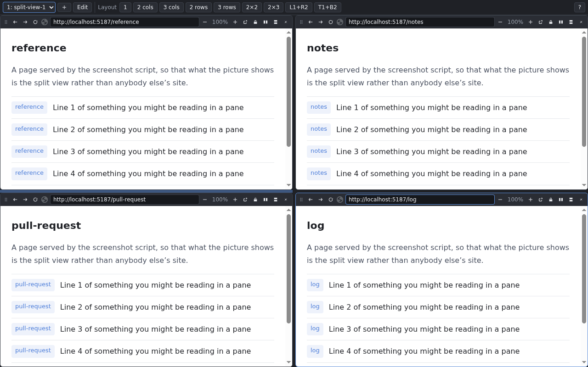
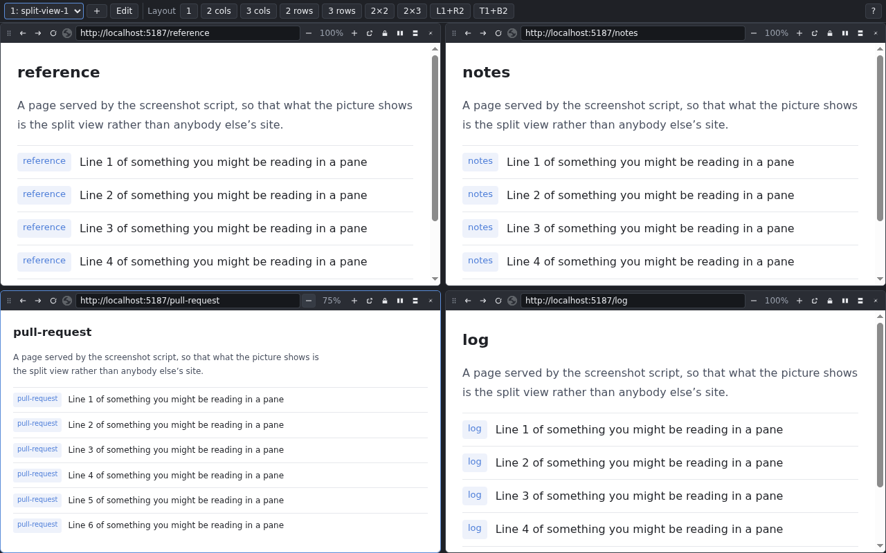
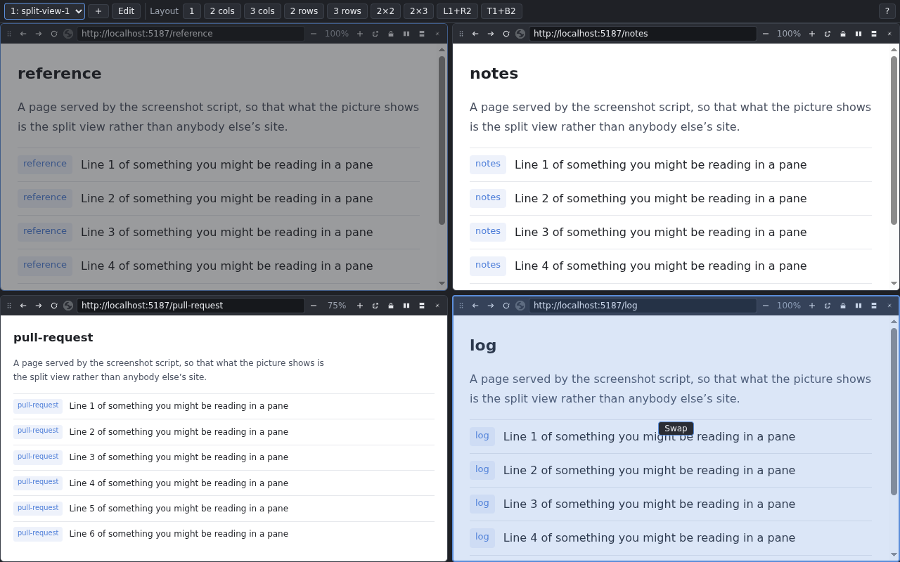
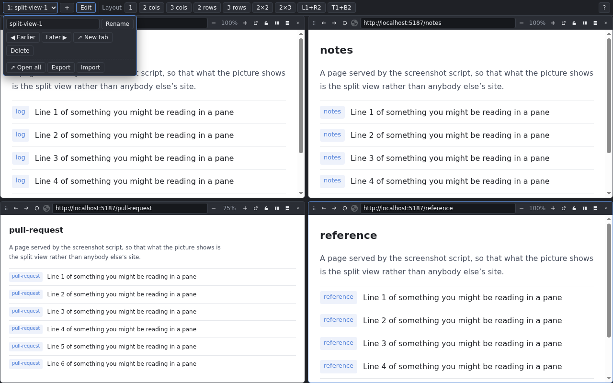

<!-- cspell:ignore nifmgpafbfpgpcijgmfpcoonjbalbkhf -->

# Split View

A Chrome extension that splits one tab into a grid of web pages. Chrome's own
split view puts two pages side by side; this one divides a single tab into as
many panes as you like, in any arrangement, and remembers the layout and the
addresses for next time.



## What it is for

Reading the documentation beside the code review beside the log. Keeping a
dashboard, a chat and a ticket in view at once without arranging four windows
by hand. Comparing the same page in two environments. Anything where you would
otherwise be switching tabs back and forth — put the pages side by side in one
tab, and keep that arrangement for the next time.

- **As many panes as you like.** Start from a preset — columns, rows, a 2×2 or
  2×3 grid, one large pane beside two small ones — and split any pane again,
  to the right or downwards, as often as you want. Drag a divider to change the
  sizes.
- **Every pane is a real page.** It has its own address bar, back and forward
  buttons, reload, and its own history. Links work, and the page stays live
  while you look at the one beside it.
- **It is all still there tomorrow.** The layout, and the page each pane had
  navigated to, are saved as you go: reload the tab, restart the browser, or
  reopen a closed tab and everything comes back where it was.
- **Nothing leaves your computer.** No account, no server, no analytics — the
  layouts live in the browser's own extension storage. See the
  [privacy policy](./docs/privacy-policy.md).

## Install

It is installed from source, as an unpacked extension. You need
[Git](https://git-scm.com/), [Node.js](https://nodejs.org/) and
[pnpm](https://pnpm.io/installation) — `npm install --global corepack` and then
`corepack enable` gives you the pnpm version the repository pins.

1. Build it:

    ```sh
    git clone --depth 1 https://github.com/noshiro-pf/mono.git
    cd mono
    pnpm install
    pnpm --filter-prod 'split-view-extension...' run build
    ```

    This builds the extension and the few libraries it uses — under a minute —
    into `apps/split-view-extension/dist`.

2. Open `chrome://extensions`, turn on **Developer mode** (top right), click
   **Load unpacked**, and choose `apps/split-view-extension/dist`.
3. Pin the extension to the toolbar and click it. That opens a split view — or
   brings you back to the one you already have open.

To update later: `git pull`, run the last two commands of step 1 again, and
press the reload button on the extension's card in `chrome://extensions`. Your
split views are kept.

## Using it

| to                                   | do this                                                                         |
| :----------------------------------- | :------------------------------------------------------------------------------ |
| open a page in a pane                | type an address (or a search) into the pane's address bar and press Enter       |
| change the whole layout              | a preset in the top bar — `2 cols`, `2×2`, `L1+R2`, …                           |
| split a pane / close it              | the split buttons in the pane's toolbar / `✕`                                   |
| resize                               | drag a divider                                                                  |
| move a pane                          | drag the grip at the left of its toolbar (`Escape` cancels)                     |
| zoom one pane                        | `−` / `+` in its toolbar, or `Ctrl` + wheel over it                             |
| add a split view (in a new tab)      | `＋` at the top left                                                            |
| open one from a link                 | `split.html?layout=r70pp&url=…&url=…` — see [Open from a URL](#open-from-a-url) |
| switch split views in this tab       | the select at the top left, or `Alt+1` … `Alt+9`                                |
| rename, reorder, delete, back up     | **Edit** — with **Export** / **Import** for the whole list as one JSON file     |
| reopen everything after a restart    | **Edit** → **↗ Open all**                                                       |
| get out of a pane that will not work | its "open in a new tab" button                                                  |

On a narrow pane, the less common buttons move into its `⋯` menu.

### Zoom one pane, not the whole tab



A site laid out for a wide window fits a narrow pane, and a small one can be
made readable — something a browser window cannot do to a quarter of itself.
The zoom is saved with the layout.

### Rearrange without reloading



Drop a pane on the middle of another to swap the two, or on an edge to take
that side of it. The page is not reloaded, so it keeps its scroll position, its
history and whatever you had typed into it.

### Keep several split views



One set of panes for writing, another for monitoring, another for a project you
come back to once a week. The number in front of each name is its `Alt` shortcut
and the number on the tab's icon, so reorder the list to give the ones you use
most the shortest reach. **↗ Open all** puts every saved split view in a tab of
its own, leaving the ones already open alone, and a split view that was in a
pinned tab comes back pinned.

### Open from a URL

The address bar always holds a link to what is on screen: which saved split
view the tab shows, the layout, the address of every pane and the zoom of any
pane that is zoomed. Bookmark it, or write one by hand and open it — a URL that
describes a split view opens it, and adds it to the list if it names none.

```text
chrome-extension://nifmgpafbfpgpcijgmfpcoonjbalbkhf/split.html
    ?layout=r70pp
    &url=https://github.com/noshiro-pf/mono/pull/2052/files
    &url=https://github.com/noshiro-pf/mono/pull/2052
```

That is a pull request's diff beside its conversation, at 7:3. The id in the
host part is the one an unpacked build has wherever it is loaded from; a build
installed from the store has an id of its own (see
[`docs/how-it-works.md`](./docs/how-it-works.md#the-list-and-what-it-is-keyed-to)).

| parameter | means                                                                                                                                                                                                                                                                                                                             |
| :-------- | :-------------------------------------------------------------------------------------------------------------------------------------------------------------------------------------------------------------------------------------------------------------------------------------------------------------------------------- |
| `layout`  | the arrangement: `p` is a pane, `r` puts the next two things side by side and `c` stacks them, each followed by the first one's share in percent when it is not 50. `rcppcpp` is a 2×2 grid, `rpcpp` one pane beside two stacked. A preset's name (`grid-2x2`, `columns-3`, …) works too. Left out, the addresses go side by side |
| `url`     | one per pane, in the order the layout names them — down each column, then rightwards. Written as in the address bar, so `github.com/…` works, and escaped as any query value is (`encodeURIComponent`), so an address with a query or a fragment of its own comes through whole. A pane with none stays empty                     |
| `zoom`    | one per pane, `0.5` to `2`. Left out, 100%                                                                                                                                                                                                                                                                                        |
| `sandbox` | one per pane, `0` to turn that pane's sandbox off (the padlock). Left out, on                                                                                                                                                                                                                                                     |
| `name`    | what to call the split view, when this URL is what adds it to the list                                                                                                                                                                                                                                                            |
| `ws`      | which saved split view to show. Alone, it opens what is saved; with the parameters above, what they describe is shown and saved under that id                                                                                                                                                                                     |

So a link with `ws=pr-review` and the parameters above reuses one saved split
view for every pull request you open this way, and a link without `ws` adds a
split view each time. A bookmark taken from the address bar carries the view as
it was when bookmarked; to bookmark a saved split view as it is now, keep only
its `ws`.

Only the address bar, a bookmark, another extension, or a page listed in the
manifest's `web_accessible_resources` can open a `chrome-extension://` URL —
an ordinary web page cannot link to one until it is listed there.

## Good to know

- **Most sites ask not to be shown inside another page.** For its own panes, and
  only in the tab a split view is open in, the extension removes that refusal;
  browsing in every other tab is untouched. Each pane is sandboxed so that a
  page in it cannot take over the whole tab.
- **Some pages cannot be put in a pane by anything** — `chrome://` pages, the
  Chrome Web Store, other extensions' pages. A pane showing one says so, and
  offers to open it in an ordinary tab.
- **A site may show you signed out in a pane**, because a pane is a third-party
  context for cookies. A sign-in or payment page that needs to take over the tab
  is stopped by the pane's sandbox; the padlock in the pane's toolbar turns the
  sandbox off for that one pane.
- **If a pane stays blank on a site that loads fine in a tab**, the site's own
  service worker may be answering for it — a signed-in GitHub is the usual case.
  The pane offers to clear it, once or always for that site.

The reasons behind each of these are in
[`docs/how-it-works.md`](./docs/how-it-works.md#what-will-not-open-in-a-pane-and-why).

## Permissions

| permission                            | why                                                       |
| :------------------------------------ | :-------------------------------------------------------- |
| `declarativeNetRequestWithHostAccess` | to remove the "do not frame me" headers for the panes     |
| `host_permissions: <all_urls>`        | those rules only act on sites the extension has access to |
| `storage`                             | to save your split views                                  |
| `favicon`                             | to show each site's icon in its pane's toolbar            |

## For developers

| document                                                   | what is in it                                                               |
| :--------------------------------------------------------- | :-------------------------------------------------------------------------- |
| [`docs/development.md`](./docs/development.md)             | setup, building, the smoke test, screenshots and packing                    |
| [`docs/how-it-works.md`](./docs/how-it-works.md)           | the design: header rules, sandbox, service workers, the pinned extension id |
| [`docs/storage-and-state.md`](./docs/storage-and-state.md) | what is stored, key by key, and the messages between the page and the panes |
| [`docs/store-listing.md`](./docs/store-listing.md)         | the Chrome Web Store copy and permission justifications                     |
