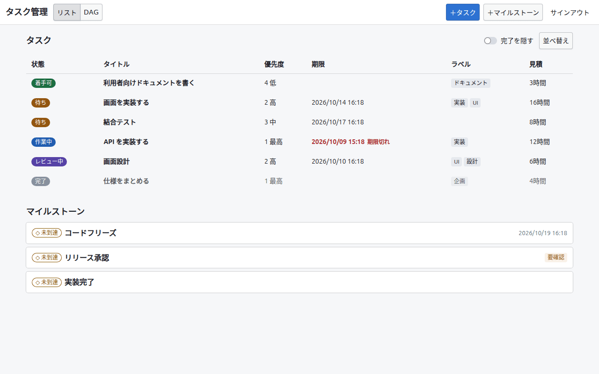
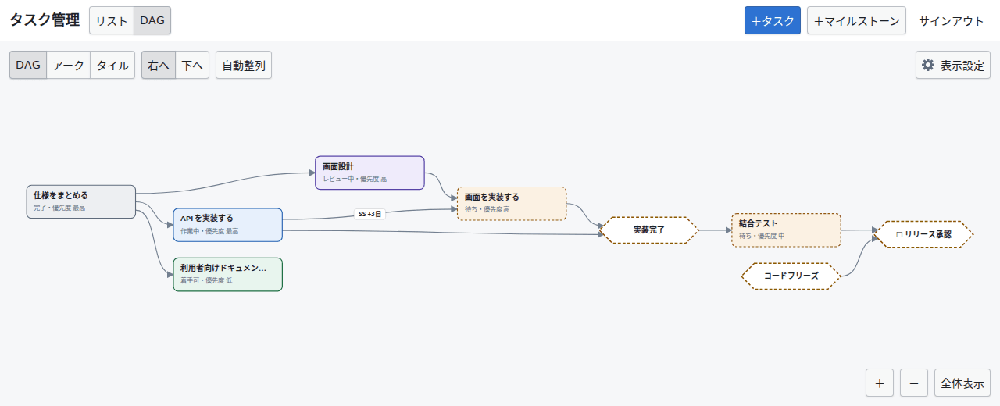
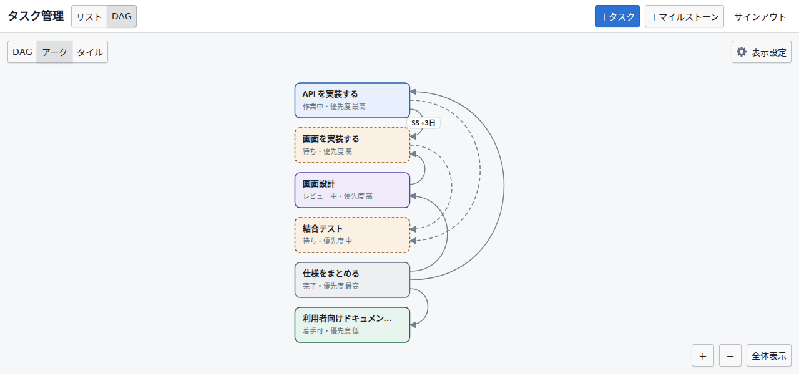
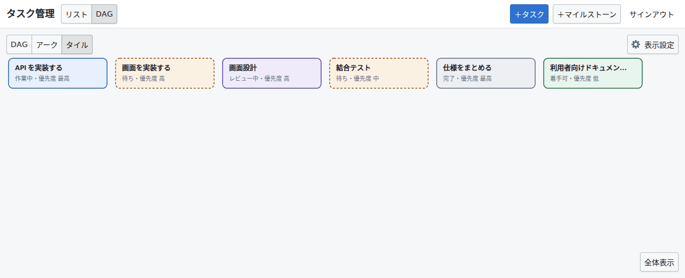
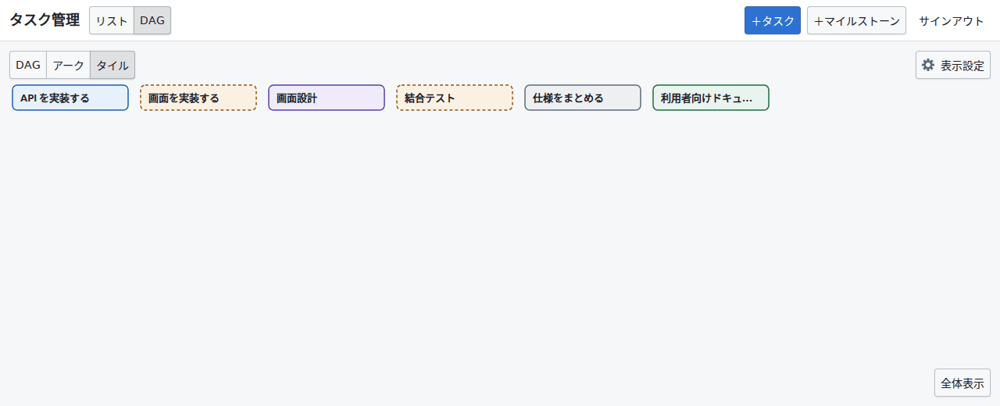
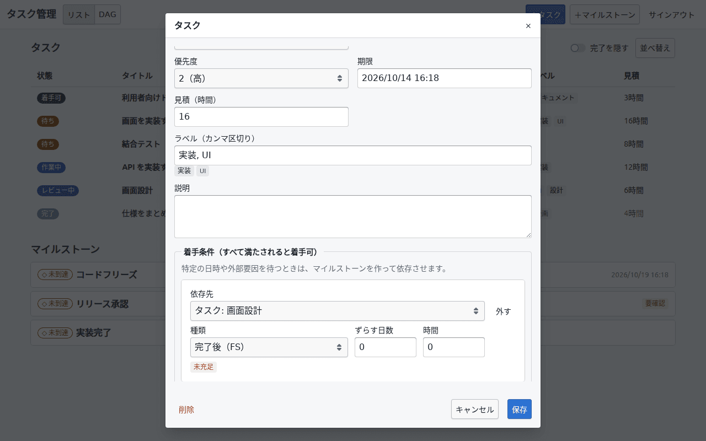
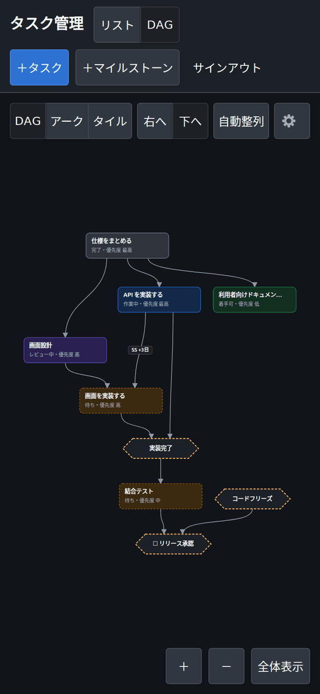
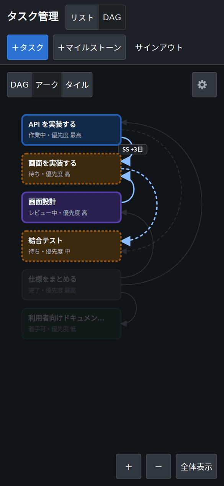
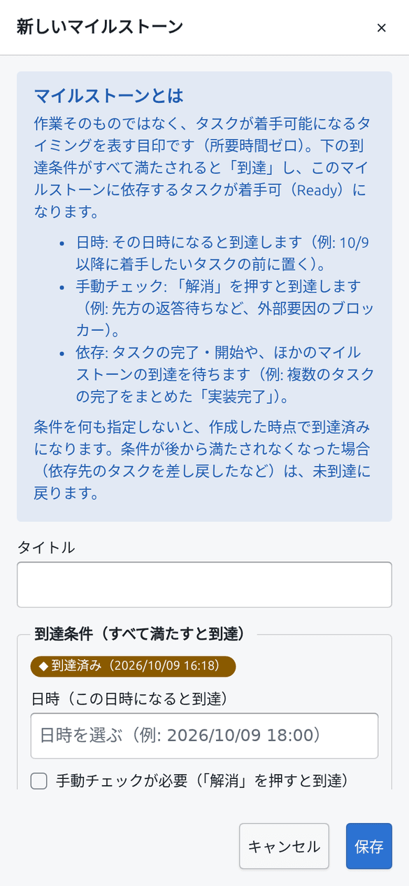
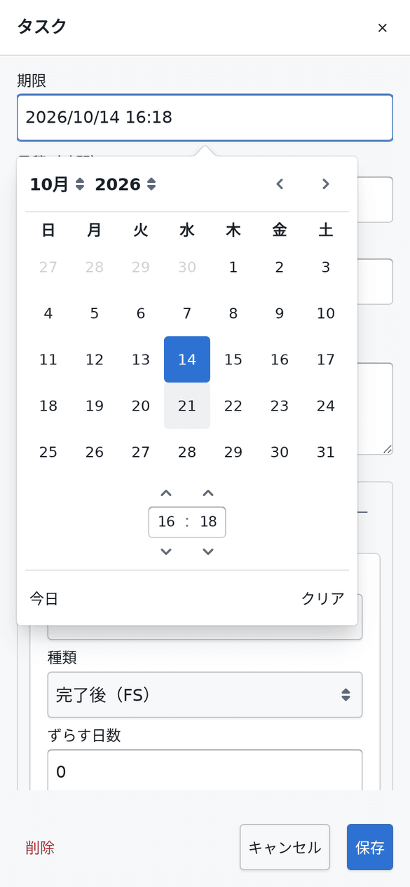

# `task-manager-app`

**タスク管理** — タスクとマイルストーンの依存関係（DAG）を中心にした個人用のタスク管理アプリ。

<https://noshiro-pf.github.io/mono/task-manager/>

## 概要

- タスクの進捗（未着手・作業中・レビュー中・完了）は手で設定し、未着手のタスクが
  「着手可」か「待ち」かは依存関係から導出する（`src/domain/`）。
- 依存は「完了後（FS）」「開始後（SS）」と、ずらす時間（ラグ）を持つ。マイルストーンは
  日時・手動確認・依存の組み合わせで到達する。循環する依存は追加できない。
- 表示はリスト（幅の広い画面では表、スマートフォンではカード）と DAG（SVG で描画）の
  2 種類。ノードをタップすると詳細ダイアログが開く。DAG の画面はツールバー先頭の
  切り替えで「DAG」「アーク」「タイル」の 3 つの表示形式を選べ、選択は端末ごとに
  `localStorage` に保存される（既定は「DAG」）。
- DAG のノードはドラッグ（または選択して矢印キー）で動かせ、位置はプロジェクトごとに
  保存されてどの端末でも同じになる。「自動整列」は ELK でレイアウトし直し、伸ばす向き
  （右へ・下へ）を選べる。位置を決めていない新しいノードは ELK の位置に置かれる。
  依存の矢印は向きに沿ってノードの辺に垂直に出入りするベジェ曲線。曲線がほかの
  ノードを横切るときは、ノードを避けて角を丸めた経路に引き直す
  （`src/dag/edge-routing.mts`）。
- DAG を最初に開いたとき、「自動整列」のあと、別の端末で保存された配置が届いたときは、
  ノードが短いアニメーションで位置へ移る。動いている間に画面を押すとすぐ止まる。
  「表示設定」の「アニメーション」で、「自動」（端末の「視差効果を減らす」に従う。
  既定）・「オン」（常に動かす）・「オフ」（動かさない）を選べ、選択は端末ごとに
  `localStorage` に保存される。どの設定でも、フレームの間隔が長すぎる（3 フレーム目
  以降の平均が 34 ms を超える、または 1 回でも 100 ms を超える）ときは重いとみなして
  途中で止め、すぐ位置に置く（`src/dag/frame-budget.mts`）。
- 「アーク」はアークダイアグラム。タスクだけを「並び順」（下記。既定はタイトル順）に
  1 列に並べ、依存を列の右側の弧で描く（`src/dag/arc-*.mts`）。
  タスク同士の依存は実線で、種類とラグ（「SS」「+3日」）を弧の頂点に書く。
  マイルストーンは描かず、マイルストーンを経由する依存は経由先のタスクまでたどって
  破線の弧にする（同じ 2 つのタスクを結ぶ直接の依存があれば描かない）。弧はノードの
  右辺から水平に出て水平に入る 3 次ベジェ曲線で、制御点を縦の距離の 2/3 だけ右に置き、
  縦の距離のおよそ半分だけ右に膨らむ半円に近い形になる。1 つのノードに付く弧は右辺に
  散らして、同じ側の長い弧が短い弧を外から囲むように並べる。タスクにポインタを
  重ねるかフォーカスすると、その弧と相手のタスクを強調し、ほかを薄くする。
  位置はデータから決まるため、ドラッグや矢印キーでは動かず、「自動整列」と向きの
  切り替えも出さない（背景のドラッグとズームはできる）。「全体表示」は幅に合わせて
  上端から表示し、縮小は 0.5 倍まで（長い列はパンして読む）。表示形式を切り替えると、
  タスクは今の位置から新しい位置へ動き、マイルストーンはフェードアウト（またはイン）し、
  画面も新しい表示に合わせて動く（「アニメーション」の設定と重いときの打ち切りに
  従う）。そのあいだ矢印は隠す。切り替えでは Firestore に
  何も書かず、保存された DAG の配置はそのまま残る。
- 「タイル」はタスクだけを、アークと同じ「並び順」（2 つの表示形式で 1 つの
  並び順を共有する）に左上から横へ並べ、画面の幅に収まらない分は次の行に
  折り返す（`src/dag/tile-layout.mts`）。依存は描かない。列数は等倍でのキャンバスの
  幅（左右の余白を除く）に収まるだけで、少なくとも 1 列。拡大縮小はせず
  （ズームボタンも出さない）、ホイール・ドラッグ（タスクの上から始めてもよい）・
  タスクにフォーカスがあるときの Page Up / Page Down / Home / End キーで縦にだけ
  スクロールする（`src/dag/tile-scroll.mts`）。最初の行がツールバーの下より下がる
  ことも、最後の行が画面下のボタンより上がることもなく、全部が収まるときは
  スクロールしない。右端の細いつまみが位置を示し、Tab でフォーカスしたタスクは
  見える位置までスクロールする。「全体表示」は先頭に戻る。タスクはドラッグや
  矢印キーでは動かない（タップか Enter で詳細を開く）。画面の幅が変わる（回転など）と
  列数を計算し直し、タスクは配置のアニメーションで新しい位置へ動き、最初に見えて
  いた行の先頭のタスクがほぼ同じ高さに残るようにスクロール位置を合わせる。
  ほかの表示形式との切り替えはアークと同じく、タスクが動き、マイルストーンが
  フェードし、Firestore には何も書かない。
- DAG の画面のツールバー右端の「表示設定」（歯車。狭い画面では歯車だけ）を押すと、
  どの表示形式にも効く設定のパネルが開く。幅の広い画面ではボタンの下に吊り下がる
  ポップオーバー、幅 600px 未満では画面下からのシート。Esc・「×」・パネルの外を
  押すと閉じ、フォーカスはボタンに戻る（`src/components/dag-settings-panel.tsx`）。
  「ノード」と「アニメーション」、アークとタイルではその間に「並び順」がある。
  ツールバーは 390px 幅でも、どの表示形式でも 1 行に収まる。
- 「ノード」はノードの大きさ。「標準」（既定）はタイトルと状態・優先度の 2 行、
  「コンパクト」はタイトルだけの 1 行で、タスクは 148×32、マイルストーンは
  140×32 の小さな六角形になる（`src/dag/graph-layout.mts` の `nodeBoxSize`）。
  タイトルは短めに切り、状態は色と枠で読める。タイトル・状態・優先度の全文は
  読み上げ名に残り、タスクではポインタを重ねたときの説明にも出る。選択は端末ごとに
  `localStorage` に保存される。DAG は新しい大きさで ELK がレイアウトし直し、矢印も
  新しい箱から引き直す。アークは列の間隔が、タイルは 1 行に並ぶ数が大きさに従う。
  切り替えると、ノードは配置のアニメーションで新しい位置へ動き（箱の大きさは
  すぐ変わる）、画面も合わせて全体表示し直す。Firestore には何も書かない。
  手で動かした DAG のノードは保存された左上の位置にとどまるため、大きさを変えると
  ほかのノードと重なったり間が空いたりすることがある。そのときは「自動整列」で
  並べ直す。
- 「並び順」はアークとタイルのタスクの順。リストの「並べ替え」と同じ編集欄で、
  キー（タイトル・期限・優先度・状態・依存の深さ・作成日時・更新日時・見積）を
  追加し、それぞれ昇順・降順を切り替え、上下に動かし、外せる。上のキーから順に比べ、
  同じなら次のキー、すべて同じなら id の順。期限や見積のないタスクはどちらの順でも
  最後。状態と依存の深さはリストと同じく、表示している時刻の状態と全体の依存関係から
  求める（`src/domain/task-sort-context.mts`）。同じキーは 2 度追加できない。キーを
  すべて外すとタイトルの昇順で並ぶ（既定もタイトルの昇順）。リストの並べ替えとは
  別の設定で、端末ごとに `localStorage` に保存される。並び順を変えたとき、タスクの
  追加・変更や時間の経過で順が変わったときは、タスクが配置のアニメーションで新しい
  位置へ動く（画面の位置はそのまま）。Firestore には何も書かない。DAG ではノードの
  位置を自分で決めるため、この欄は出さない。
- 時間の経過で状態が変わる時刻（`nextChangeAt`）に合わせて表示を更新する。
- データは Cloud Firestore（オフラインキャッシュあり）、サインインは Firebase Auth の
  Google サインイン。iPhone・iPad・PC のブラウザで使う。

## 画面

デモモード（下記）のサンプルデータで撮ったもの。画面を変えたら撮り直す。

リスト。状態（着手可・待ち・作業中など）は依存関係から導出され、期限切れは赤で示す。



DAG（右へ）。自動整列した状態。ノードはドラッグで動かせる。



アーク。タスクだけをタイトル順に並べ、依存を右側の弧で示す。破線はマイルストーンを
経由する依存。



タイル。タスクだけをタイトル順に左上から横に並べ、幅に収まらない分は次の行に
折り返す。縦にスクロールして読む。



タイル（ノード「コンパクト」）。タイトルだけの小さな箱で、1 行に多く並ぶ。



タスクの詳細。着手条件は 1 行ずつ編集し、入力した行は保存時にそのまま反映される。



スマートフォン幅。DAG（下へ、ダークモード）、アーク（ダークモード、ポインタを重ねた
タスクの依存を強調）、新しいマイルストーン、期限の日時ピッカー。









## 開発

```sh
pnpm run dev          # http://localhost:5195/mono/task-manager/
pnpm run check:test   # 単体テスト
pnpm run check:e2e    # Playwright（デモモードで動かす）
pnpm run build        # build/ に出力。GitHub Pages へは deploy-pages.yml が載せる
```

### デモモード

開発サーバーで `?storage=memory` を付けて開くと、サインインせずにサンプルデータ入りの
メモリ上のリポジトリで動く（再読み込みで元に戻る）。

<http://localhost:5195/mono/task-manager/?storage=memory>

`import.meta.env.DEV` が条件に入っているため、本番ビルドにはこの経路もサンプルデータも
含まれない。

## Firebase の手作業

Firebase プロジェクトは `task-manager-app-d0cae`（`.firebaserc`）。次はリポジトリの
CI では行われないので、オーナーが手で行う。

1. **セキュリティルールのデプロイ**: このディレクトリで
   `firebase deploy --only firestore:rules`。`firestore.rules` を変更しただけでは
   反映されない。`firebase-tools` は依存に入れていないので、手元に入れて使う。
2. **承認済みドメイン**: Authentication → 設定 → 承認済みドメインに `localhost` と
   `noshiro-pf.github.io` を入れる。
3. **ログインプロバイダ**: Authentication → ログイン方法で Google を有効にする。
   `firestore.rules` も Google でサインインしたトークンしか受け付けないので、
   ほかのプロバイダを有効にしてもデータには触れない。

サインインはポップアップで行う。ページ（`noshiro-pf.github.io`）と認証ドメイン
（`firebaseapp.com`）が別のため、リダイレクト方式は Safari（iOS のすべてのブラウザ）の
ストレージ分離で失敗する。

## データ構造

```text
projects/{projectId}                           { name, ownerUid, memberUids, createdAt }
projects/{projectId}/tasks/{taskId}            タスク（id を除く）
projects/{projectId}/milestones/{milestoneId}  マイルストーン（id を除く）
projects/{projectId}/settings/dagLayout        DAG の向きとノードの位置
                                               { direction, positions: { [nodeId]: { x, y } }, updatedAt }
```

初回サインイン時に、自分の uid を id とする個人プロジェクトを作る。画面は今のところ
この 1 つだけを使う。値のない項目は `null` で保存し、読み込んだ文書はすべて検証して、
不正なものは警告を出して読み飛ばす（`src/repository/converters.mts`）。
