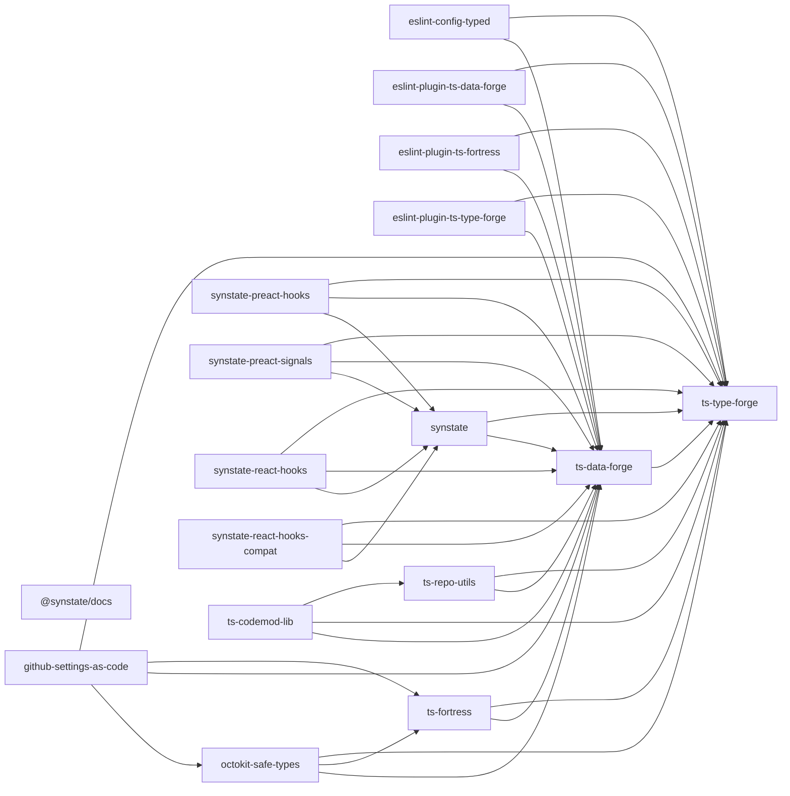

<!-- AUTO-GENERATED FILE. DO NOT EDIT DIRECTLY. -->
<!-- Regenerate with `pnpm run docs:deps`. -->

# パッケージ間の依存関係

このリポジトリの workspace パッケージは 17 個。
グラフは各 `package.json` から生成している。

## 実行時依存（`dependencies` + `peerDependencies`）

公開されるパッケージの依存関係。非循環であることを生成時に検証している。

## ビルド順

`pnpm run ws:build`（`runCmdInStagesAcrossWorkspaces`）は
`dependencies` + `devDependencies` + `peerDependencies` を 1 つのグラフに
合成し、**指定子の種類に関わらずパッケージ名だけで**エッジを張る。
したがって内部パッケージへの devDependency もビルド順を拘束する。

### 実行時依存だけから決まる段階

| 段階 | パッケージ |
| ---: | :--- |
| 1 | `@synstate/docs`, `ts-type-forge` |
| 2 | `ts-data-forge` |
| 3 | `eslint-config-typed`, `eslint-plugin-ts-data-forge`, `eslint-plugin-ts-fortress`, `eslint-plugin-ts-type-forge`, `synstate`, `ts-fortress`, `ts-repo-utils` |
| 4 | `octokit-safe-types`, `synstate-preact-hooks`, `synstate-preact-signals`, `synstate-react-hooks`, `synstate-react-hooks-compat`, `ts-codemod-lib` |
| 5 | `github-settings-as-code` |

### 実際に `ws:build` が使う段階

| 段階 | パッケージ |
| ---: | :--- |
| 1 | `ts-type-forge` |
| 2 | `ts-data-forge` |
| 3 | `eslint-config-typed`, `eslint-plugin-ts-data-forge`, `eslint-plugin-ts-fortress`, `eslint-plugin-ts-type-forge`, `synstate`, `ts-fortress`, `ts-repo-utils` |
| 4 | `octokit-safe-types`, `synstate-preact-hooks`, `synstate-preact-signals`, `synstate-react-hooks`, `synstate-react-hooks-compat`, `ts-codemod-lib` |
| 5 | `@synstate/docs`, `github-settings-as-code` |

## `workspace:` プロトコルの状況

| パッケージ | 種別 | 内部依存 |
| :--- | :--- | :--- |
| `@synstate/docs` | dev | `synstate`&nbsp;`workspace:*` `synstate-preact-hooks`&nbsp;`workspace:*` `synstate-preact-signals`&nbsp;`workspace:*` `synstate-react-hooks`&nbsp;`workspace:*` |
| `eslint-config-typed` | dep | `ts-data-forge`&nbsp;`workspace:^` `ts-type-forge`&nbsp;`workspace:^` |
| `eslint-plugin-ts-data-forge` | dep | `ts-data-forge`&nbsp;`workspace:*` `ts-type-forge`&nbsp;`workspace:~` |
| `eslint-plugin-ts-fortress` | dep | `ts-data-forge`&nbsp;`workspace:~` `ts-type-forge`&nbsp;`workspace:~` |
| `eslint-plugin-ts-type-forge` | dep | `ts-data-forge`&nbsp;`workspace:~` `ts-type-forge`&nbsp;`workspace:*` |
| `github-settings-as-code` | dep | `octokit-safe-types`&nbsp;`workspace:^` `ts-data-forge`&nbsp;`workspace:^` `ts-fortress`&nbsp;`workspace:^` `ts-type-forge`&nbsp;`workspace:^` |
| `octokit-safe-types` | dep | `ts-data-forge`&nbsp;`workspace:^` `ts-fortress`&nbsp;`workspace:^` `ts-type-forge`&nbsp;`workspace:^` |
| `synstate` | dep | `ts-data-forge`&nbsp;`workspace:^` `ts-type-forge`&nbsp;`workspace:^` |
| `synstate-preact-hooks` | dep | `synstate`&nbsp;`workspace:*` `ts-data-forge`&nbsp;`workspace:^` `ts-type-forge`&nbsp;`workspace:^` |
| `synstate-preact-signals` | dep | `synstate`&nbsp;`workspace:*` `ts-data-forge`&nbsp;`workspace:^` `ts-type-forge`&nbsp;`workspace:^` |
| `synstate-react-hooks` | dep | `synstate`&nbsp;`workspace:*` `ts-data-forge`&nbsp;`workspace:^` `ts-type-forge`&nbsp;`workspace:^` |
| `synstate-react-hooks-compat` | dep | `synstate`&nbsp;`workspace:*` `ts-data-forge`&nbsp;`workspace:^` `ts-type-forge`&nbsp;`workspace:^` |
| `ts-codemod-lib` | dep | `ts-data-forge`&nbsp;`workspace:^` `ts-type-forge`&nbsp;`workspace:^` |
| `ts-codemod-lib` | peer | `ts-repo-utils`&nbsp;`8.1.0` |
| `ts-codemod-lib` | dev | `ts-repo-utils`&nbsp;`10.1.8` |
| `ts-data-forge` | dep | `ts-type-forge`&nbsp;`workspace:~` |
| `ts-fortress` | dep | `ts-data-forge`&nbsp;`workspace:~` `ts-type-forge`&nbsp;`workspace:~` |
| `ts-repo-utils` | dep | `ts-data-forge`&nbsp;`workspace:^` `ts-type-forge`&nbsp;`workspace:^` |
| `ts-type-forge` | — | — |

16 / 17 のパッケージが少なくとも 1 つの内部依存を `workspace:` で解決している。

### root（`package.json`、非公開）

root はワークスペースメンバーではないので、上のビルド順グラフには現れない。
ここに並ぶのはリポジトリ自身の lint / codemod / 設定適用に使うツールチェーン。

| パッケージ | 指定 |
| :--- | :--- |
| `eslint-config-typed` | `workspace:*` |
| `eslint-plugin-ts-data-forge` | `workspace:*` |
| `eslint-plugin-ts-fortress` | `workspace:*` |
| `eslint-plugin-ts-type-forge` | `workspace:*` |
| `github-settings-as-code` | `2.1.0` |
| `ts-codemod-lib` | `2.2.5` |
| `ts-data-forge` | `14.2.0` |
| `ts-fortress` | `workspace:*` |
| `ts-repo-utils` | `10.1.8` |
| `ts-type-forge` | `9.2.0` |

## なぜ一部だけ npm 版のままなのか

root の依存を `workspace:` にすると、そのパッケージは `dist/` を持つまで
解決できなくなる。したがって基準は 1 つ:

> **`ws:build` より前に動くものが必要とするパッケージは、npm の公開版のまま。**

該当するのは 5 つ。

| パッケージ | `ws:build` より前に必要な理由 |
| :--- | :--- |
| `ts-data-forge` | 17 パッケージすべての `scripts/cmd/build.mts` が import する |
| `ts-repo-utils` | 同上。加えて `check-should-run-type-checks` / `assert-repo-is-clean` を CI がビルド前に実行する |
| `ts-type-forge` | 上 2 つの実行時依存 |
| `ts-codemod-lib` | `eslint-config-typed` のビルド中の `gen-rule-type` が実行する |
| `github-settings-as-code` | `backup-repository-settings` workflow が `repo-settings` をビルドせずに実行する |

lint ツールチェーン（`eslint-config-typed`、`eslint-plugin-ts-*`）はビルド後に
しか使わないので `workspace:` にできる。これでリポジトリは自分自身の lint 設定で
lint されるようになり、変更を publish せずに検証できる。

### ステージランナーに見えない制約を消す

lint ツールチェーンをリンクすると、ランナーが知り得ない順序制約が生まれる。
各パッケージの build は自分の `tsconfig.json` で型チェックするが、その対象に
lint 設定が含まれており、lint 設定は lint ツールチェーンを import するためだ。
`eslint-config-typed` は `ts-data-forge` に依存するので同じ段階以降にしか
ビルドされず、依存関係として宣言することもできない（宣言すると循環する）。

解決は「ビルドの型チェック対象から lint 設定を外す」こと。

- `eslint.config.mts` を各パッケージの `tsconfig.json` の `include` から除外した。
  17 パッケージ中 7 つは元々そうなっていた。root の `tsconfig.json` が
  `./**/eslint.config*.mts` を含むので、型チェック自体は失われない
- 残る 2 箇所（`ts-data-forge/configs/eslint/`、
  `eslint-config-typed/scripts/gen-eslint-rules/`）は型のみの import なので、
  `paths` でソースに解決させた
- `check-all` の `check:root` を `ws:build` の後ろへ移した

### 各パッケージの devDependency をリンクしない理由

ツールチェーンを root ではなく各パッケージの devDependency として
`workspace:*` にすると、`ws:build` の順序が決まらなくなる。ランナーが
devDependency もグラフに含めるため、`ts-data-forge` → `eslint-config-typed` →
`ts-data-forge` のような循環が必ずできるからだ。

取りうる手は 2 つ。いずれも未着手:

1. `runCmdInStagesAcrossWorkspaces` に「ビルド順は `dependencies` +
   `peerDependencies` だけで決める」オプションを足す（`ts-repo-utils` 側の変更）
2. 現状どおり root にまとめておく
