<!-- AUTO-GENERATED FILE. DO NOT EDIT DIRECTLY. -->
<!-- Regenerate with `pnpm run docs:deps`. -->

# パッケージ間の依存関係

このリポジトリの workspace パッケージは 50 個。
グラフは各 `package.json` から生成している。

## 実行時依存（`dependencies` + `peerDependencies`）

公開されるパッケージの依存関係。非循環であることを生成時に検証している。

```mermaid
graph LR
  blueprintjs_playground["blueprintjs-playground"]
  blueprintjs_playground_styled["blueprintjs-playground-styled"]
  cant_stop_probability_app["cant-stop-probability-app"]
  catan_dice_app["catan-dice-app"]
  color_demo_app["color-demo-app"]
  event_schedule_app["event-schedule-app"]
  event_schedule_app_shared["event-schedule-app-shared"]
  housing_loan_calculator_app["housing-loan-calculator-app"]
  lambda_calculus_interpreter_core["lambda-calculus-interpreter-core"]
  lambda_calculus_interpreter_preact["lambda-calculus-interpreter-preact"]
  lambda_calculus_interpreter_react["lambda-calculus-interpreter-react"]
  mahjong_calculator_app["mahjong-calculator-app"]
  mahjong_scoring_tool["mahjong-scoring-tool"]
  my_portfolio_app_preact["my-portfolio-app-preact"]
  numeric_input_utils["numeric-input-utils"]
  poll_discord_app["poll-discord-app"]
  preact_utils["preact-utils"]
  react_blueprintjs_utils["react-blueprintjs-utils"]
  react_mui_utils["react-mui-utils"]
  react_utils["react-utils"]
  react_utils_styled["react-utils-styled"]
  resize_observer_preact_hooks["resize-observer-preact-hooks"]
  resize_observer_react_hooks["resize-observer-react-hooks"]
  slack_archive_tools["slack-archive-tools"]
  _synstate_docs["@synstate/docs"]
  tiny_router_observable["tiny-router-observable"]
  tiny_router_preact_hooks["tiny-router-preact-hooks"]
  tiny_router_react_hooks["tiny-router-react-hooks"]
  ts_fortress_types["ts-fortress-types"]
  ts_utils_additional["ts-utils-additional"]
  better_preact_use_state["better-preact-use-state"]
  better_react_use_state["better-react-use-state"]
  eslint_config_typed["eslint-config-typed"]
  eslint_plugin_ts_data_forge["eslint-plugin-ts-data-forge"]
  eslint_plugin_ts_fortress["eslint-plugin-ts-fortress"]
  eslint_plugin_ts_type_forge["eslint-plugin-ts-type-forge"]
  github_settings_as_code["github-settings-as-code"]
  octokit_safe_types["octokit-safe-types"]
  synstate["synstate"]
  synstate_preact_hooks["synstate-preact-hooks"]
  synstate_preact_signals["synstate-preact-signals"]
  synstate_react_hooks["synstate-react-hooks"]
  synstate_react_hooks_compat["synstate-react-hooks-compat"]
  ts_codemod_cli["ts-codemod-cli"]
  ts_codemod_lib["ts-codemod-lib"]
  ts_data_forge["ts-data-forge"]
  ts_fortress["ts-fortress"]
  ts_repo_utils["ts-repo-utils"]
  ts_std_forge["ts-std-forge"]
  ts_type_forge["ts-type-forge"]
  blueprintjs_playground --> react_utils
  blueprintjs_playground_styled --> react_blueprintjs_utils
  blueprintjs_playground_styled --> react_utils
  cant_stop_probability_app --> react_blueprintjs_utils
  cant_stop_probability_app --> react_utils
  cant_stop_probability_app --> synstate
  cant_stop_probability_app --> synstate_react_hooks
  cant_stop_probability_app --> ts_data_forge
  cant_stop_probability_app --> ts_fortress
  catan_dice_app --> react_utils
  catan_dice_app --> synstate
  catan_dice_app --> synstate_react_hooks
  catan_dice_app --> ts_data_forge
  color_demo_app --> better_react_use_state
  color_demo_app --> react_mui_utils
  color_demo_app --> react_utils
  color_demo_app --> ts_data_forge
  color_demo_app --> ts_utils_additional
  event_schedule_app --> better_react_use_state
  event_schedule_app --> event_schedule_app_shared
  event_schedule_app --> numeric_input_utils
  event_schedule_app --> react_blueprintjs_utils
  event_schedule_app --> react_utils
  event_schedule_app --> synstate
  event_schedule_app --> synstate_react_hooks
  event_schedule_app --> tiny_router_observable
  event_schedule_app --> tiny_router_react_hooks
  event_schedule_app --> ts_data_forge
  event_schedule_app --> ts_fortress
  event_schedule_app --> ts_fortress_types
  event_schedule_app_shared --> ts_data_forge
  event_schedule_app_shared --> ts_fortress
  event_schedule_app_shared --> ts_fortress_types
  housing_loan_calculator_app --> numeric_input_utils
  housing_loan_calculator_app --> react_blueprintjs_utils
  housing_loan_calculator_app --> react_utils
  housing_loan_calculator_app --> synstate
  housing_loan_calculator_app --> synstate_react_hooks
  housing_loan_calculator_app --> tiny_router_observable
  housing_loan_calculator_app --> ts_data_forge
  housing_loan_calculator_app --> ts_fortress
  lambda_calculus_interpreter_core --> ts_data_forge
  lambda_calculus_interpreter_preact --> lambda_calculus_interpreter_core
  lambda_calculus_interpreter_preact --> preact_utils
  lambda_calculus_interpreter_preact --> synstate
  lambda_calculus_interpreter_preact --> synstate_preact_hooks
  lambda_calculus_interpreter_preact --> ts_data_forge
  lambda_calculus_interpreter_react --> lambda_calculus_interpreter_core
  lambda_calculus_interpreter_react --> react_utils
  lambda_calculus_interpreter_react --> synstate
  lambda_calculus_interpreter_react --> synstate_react_hooks
  lambda_calculus_interpreter_react --> ts_data_forge
  mahjong_calculator_app --> preact_utils
  mahjong_calculator_app --> synstate
  mahjong_calculator_app --> synstate_preact_hooks
  mahjong_calculator_app --> ts_data_forge
  mahjong_calculator_app --> ts_fortress
  mahjong_scoring_tool --> ts_data_forge
  my_portfolio_app_preact --> better_preact_use_state
  my_portfolio_app_preact --> preact_utils
  my_portfolio_app_preact --> resize_observer_preact_hooks
  my_portfolio_app_preact --> synstate_preact_hooks
  my_portfolio_app_preact --> tiny_router_observable
  my_portfolio_app_preact --> ts_data_forge
  numeric_input_utils --> ts_data_forge
  poll_discord_app --> ts_data_forge
  poll_discord_app --> ts_fortress
  preact_utils --> better_preact_use_state
  preact_utils --> synstate
  preact_utils --> ts_data_forge
  react_blueprintjs_utils --> better_react_use_state
  react_blueprintjs_utils --> react_utils
  react_blueprintjs_utils --> synstate
  react_blueprintjs_utils --> synstate_react_hooks
  react_blueprintjs_utils --> ts_data_forge
  react_blueprintjs_utils --> ts_fortress_types
  react_mui_utils --> better_react_use_state
  react_mui_utils --> react_utils
  react_mui_utils --> react_utils_styled
  react_mui_utils --> ts_data_forge
  react_utils --> better_react_use_state
  react_utils --> synstate
  react_utils --> ts_data_forge
  react_utils_styled --> better_react_use_state
  react_utils_styled --> react_utils
  react_utils_styled --> resize_observer_react_hooks
  react_utils_styled --> ts_data_forge
  resize_observer_preact_hooks --> better_preact_use_state
  resize_observer_preact_hooks --> ts_data_forge
  resize_observer_react_hooks --> better_react_use_state
  resize_observer_react_hooks --> ts_data_forge
  slack_archive_tools --> ts_data_forge
  slack_archive_tools --> ts_fortress
  slack_archive_tools --> ts_repo_utils
  _synstate_docs --> synstate
  _synstate_docs --> synstate_preact_hooks
  _synstate_docs --> synstate_preact_signals
  _synstate_docs --> synstate_react_hooks
  tiny_router_observable --> synstate
  tiny_router_observable --> ts_data_forge
  ts_fortress_types --> ts_data_forge
  ts_fortress_types --> ts_fortress
  ts_utils_additional --> ts_data_forge
  eslint_config_typed --> ts_data_forge
  eslint_config_typed --> ts_type_forge
  eslint_plugin_ts_data_forge --> ts_data_forge
  eslint_plugin_ts_data_forge --> ts_type_forge
  eslint_plugin_ts_fortress --> ts_data_forge
  eslint_plugin_ts_fortress --> ts_type_forge
  eslint_plugin_ts_type_forge --> ts_data_forge
  eslint_plugin_ts_type_forge --> ts_type_forge
  github_settings_as_code --> octokit_safe_types
  github_settings_as_code --> ts_data_forge
  github_settings_as_code --> ts_fortress
  github_settings_as_code --> ts_repo_utils
  github_settings_as_code --> ts_type_forge
  octokit_safe_types --> ts_data_forge
  octokit_safe_types --> ts_fortress
  octokit_safe_types --> ts_type_forge
  synstate --> ts_data_forge
  synstate --> ts_type_forge
  synstate_preact_hooks --> synstate
  synstate_preact_hooks --> ts_data_forge
  synstate_preact_hooks --> ts_type_forge
  synstate_preact_signals --> synstate
  synstate_preact_signals --> ts_data_forge
  synstate_preact_signals --> ts_type_forge
  synstate_react_hooks --> synstate
  synstate_react_hooks --> ts_data_forge
  synstate_react_hooks --> ts_type_forge
  synstate_react_hooks_compat --> synstate
  synstate_react_hooks_compat --> ts_data_forge
  synstate_react_hooks_compat --> ts_type_forge
  ts_codemod_cli --> ts_codemod_lib
  ts_codemod_cli --> ts_data_forge
  ts_codemod_cli --> ts_repo_utils
  ts_codemod_lib --> ts_data_forge
  ts_codemod_lib --> ts_type_forge
  ts_data_forge --> ts_type_forge
  ts_fortress --> ts_data_forge
  ts_fortress --> ts_type_forge
  ts_repo_utils --> ts_data_forge
  ts_repo_utils --> ts_type_forge
  ts_std_forge --> ts_data_forge
  ts_std_forge --> ts_type_forge
```

## ビルド順

`pnpm run ws:build` は `runCmdInStagesAcrossWorkspaces` に
`dependencyFields: ['dependencies', 'peerDependencies']` を渡す。
ビルドを走らせるのに必要なのは「公開されるソースが型として import する
パッケージ」だけで、devDependency が指す先（lint・テスト・スクリプトの
ツールチェーン）は全パッケージのビルドが終わってから使われるためである。

### `ws:build` が使う段階

| 段階 | パッケージ                                                                                                                                                                                                                                                                                                                                                              |
| ---: | :---------------------------------------------------------------------------------------------------------------------------------------------------------------------------------------------------------------------------------------------------------------------------------------------------------------------------------------------------------------------- |
|    1 | `tiny-router-preact-hooks`, `tiny-router-react-hooks`, `better-preact-use-state`, `better-react-use-state`, `ts-type-forge`                                                                                                                                                                                                                                             |
|    2 | `ts-data-forge`                                                                                                                                                                                                                                                                                                                                                         |
|    3 | `lambda-calculus-interpreter-core`, `mahjong-scoring-tool`, `numeric-input-utils`, `resize-observer-preact-hooks`, `resize-observer-react-hooks`, `ts-utils-additional`, `eslint-config-typed`, `eslint-plugin-ts-data-forge`, `eslint-plugin-ts-fortress`, `eslint-plugin-ts-type-forge`, `synstate`, `ts-codemod-lib`, `ts-fortress`, `ts-repo-utils`, `ts-std-forge` |
|    4 | `poll-discord-app`, `preact-utils`, `react-utils`, `slack-archive-tools`, `tiny-router-observable`, `ts-fortress-types`, `octokit-safe-types`, `synstate-preact-hooks`, `synstate-preact-signals`, `synstate-react-hooks`, `synstate-react-hooks-compat`, `ts-codemod-cli`                                                                                              |
|    5 | `blueprintjs-playground`, `catan-dice-app`, `event-schedule-app-shared`, `lambda-calculus-interpreter-preact`, `lambda-calculus-interpreter-react`, `mahjong-calculator-app`, `my-portfolio-app-preact`, `react-blueprintjs-utils`, `react-utils-styled`, `@synstate/docs`, `github-settings-as-code`                                                                   |
|    6 | `blueprintjs-playground-styled`, `cant-stop-probability-app`, `event-schedule-app`, `housing-loan-calculator-app`, `react-mui-utils`                                                                                                                                                                                                                                    |
|    7 | `color-demo-app`                                                                                                                                                                                                                                                                                                                                                        |

### 参考: devDependencies も含めた場合

循環があり、段階に分解できない。

## `workspace:` プロトコルの状況

| パッケージ                           | 種別 | 内部依存                                                                                                                                                                                                                                                                                                                                                                                                                                                                                                                       |
| :----------------------------------- | :--- | :----------------------------------------------------------------------------------------------------------------------------------------------------------------------------------------------------------------------------------------------------------------------------------------------------------------------------------------------------------------------------------------------------------------------------------------------------------------------------------------------------------------------------- |
| `blueprintjs-playground`             | dep  | `react-utils`&nbsp;`workspace:*`                                                                                                                                                                                                                                                                                                                                                                                                                                                                                               |
| `blueprintjs-playground`             | dev  | `eslint-config-typed`&nbsp;`workspace:*` `eslint-plugin-ts-data-forge`&nbsp;`workspace:*` `eslint-plugin-ts-type-forge`&nbsp;`workspace:*`                                                                                                                                                                                                                                                                                                                                                                               |
| `blueprintjs-playground-styled`      | dep  | `react-blueprintjs-utils`&nbsp;`workspace:*` `react-utils`&nbsp;`workspace:*`                                                                                                                                                                                                                                                                                                                                                                                                                                               |
| `blueprintjs-playground-styled`      | dev  | `eslint-config-typed`&nbsp;`workspace:*` `eslint-plugin-ts-data-forge`&nbsp;`workspace:*` `eslint-plugin-ts-type-forge`&nbsp;`workspace:*`                                                                                                                                                                                                                                                                                                                                                                               |
| `cant-stop-probability-app`          | dep  | `react-blueprintjs-utils`&nbsp;`workspace:*` `react-utils`&nbsp;`workspace:*` `synstate`&nbsp;`workspace:*` `synstate-react-hooks`&nbsp;`workspace:*` `ts-data-forge`&nbsp;`workspace:*` `ts-fortress`&nbsp;`workspace:*`                                                                                                                                                                                                                                                                                       |
| `cant-stop-probability-app`          | dev  | `eslint-config-typed`&nbsp;`workspace:*` `eslint-plugin-ts-data-forge`&nbsp;`workspace:*` `eslint-plugin-ts-fortress`&nbsp;`workspace:*` `eslint-plugin-ts-type-forge`&nbsp;`workspace:*` `ts-type-forge`&nbsp;`workspace:*`                                                                                                                                                                                                                                                                                       |
| `catan-dice-app`                     | dep  | `react-utils`&nbsp;`workspace:*` `synstate`&nbsp;`workspace:*` `synstate-react-hooks`&nbsp;`workspace:*` `ts-data-forge`&nbsp;`workspace:*`                                                                                                                                                                                                                                                                                                                                                                           |
| `catan-dice-app`                     | dev  | `eslint-config-typed`&nbsp;`workspace:*` `eslint-plugin-ts-data-forge`&nbsp;`workspace:*`                                                                                                                                                                                                                                                                                                                                                                                                                                   |
| `color-demo-app`                     | dep  | `better-react-use-state`&nbsp;`workspace:*` `react-mui-utils`&nbsp;`workspace:*` `react-utils`&nbsp;`workspace:*` `ts-data-forge`&nbsp;`workspace:*` `ts-utils-additional`&nbsp;`workspace:*`                                                                                                                                                                                                                                                                                                                      |
| `color-demo-app`                     | dev  | `eslint-config-typed`&nbsp;`workspace:*` `eslint-plugin-ts-data-forge`&nbsp;`workspace:*`                                                                                                                                                                                                                                                                                                                                                                                                                                   |
| `event-schedule-app`                 | dep  | `better-react-use-state`&nbsp;`workspace:*` `event-schedule-app-shared`&nbsp;`workspace:*` `numeric-input-utils`&nbsp;`workspace:*` `react-blueprintjs-utils`&nbsp;`workspace:*` `react-utils`&nbsp;`workspace:*` `synstate`&nbsp;`workspace:*` `synstate-react-hooks`&nbsp;`workspace:*` `tiny-router-observable`&nbsp;`workspace:*` `tiny-router-react-hooks`&nbsp;`workspace:*` `ts-data-forge`&nbsp;`workspace:*` `ts-fortress`&nbsp;`workspace:*` `ts-fortress-types`&nbsp;`workspace:*` |
| `event-schedule-app`                 | dev  | `eslint-config-typed`&nbsp;`workspace:*` `eslint-plugin-ts-data-forge`&nbsp;`workspace:*` `eslint-plugin-ts-fortress`&nbsp;`workspace:*` `eslint-plugin-ts-type-forge`&nbsp;`workspace:*` `ts-type-forge`&nbsp;`workspace:*`                                                                                                                                                                                                                                                                                       |
| `event-schedule-app-shared`          | dep  | `ts-data-forge`&nbsp;`workspace:*` `ts-fortress`&nbsp;`workspace:*` `ts-fortress-types`&nbsp;`workspace:*`                                                                                                                                                                                                                                                                                                                                                                                                               |
| `event-schedule-app-shared`          | dev  | `eslint-config-typed`&nbsp;`workspace:*` `eslint-plugin-ts-data-forge`&nbsp;`workspace:*` `eslint-plugin-ts-fortress`&nbsp;`workspace:*` `eslint-plugin-ts-type-forge`&nbsp;`workspace:*` `ts-type-forge`&nbsp;`workspace:*`                                                                                                                                                                                                                                                                                       |
| `housing-loan-calculator-app`        | dep  | `numeric-input-utils`&nbsp;`workspace:*` `react-blueprintjs-utils`&nbsp;`workspace:*` `react-utils`&nbsp;`workspace:*` `synstate`&nbsp;`workspace:*` `synstate-react-hooks`&nbsp;`workspace:*` `tiny-router-observable`&nbsp;`workspace:*` `ts-data-forge`&nbsp;`workspace:*` `ts-fortress`&nbsp;`workspace:*`                                                                                                                                                                                            |
| `housing-loan-calculator-app`        | dev  | `eslint-config-typed`&nbsp;`workspace:*` `eslint-plugin-ts-data-forge`&nbsp;`workspace:*` `eslint-plugin-ts-fortress`&nbsp;`workspace:*` `eslint-plugin-ts-type-forge`&nbsp;`workspace:*` `ts-type-forge`&nbsp;`workspace:*`                                                                                                                                                                                                                                                                                       |
| `lambda-calculus-interpreter-core`   | dep  | `ts-data-forge`&nbsp;`workspace:*`                                                                                                                                                                                                                                                                                                                                                                                                                                                                                             |
| `lambda-calculus-interpreter-core`   | dev  | `eslint-config-typed`&nbsp;`workspace:*` `eslint-plugin-ts-data-forge`&nbsp;`workspace:*` `eslint-plugin-ts-type-forge`&nbsp;`workspace:*` `ts-type-forge`&nbsp;`workspace:*`                                                                                                                                                                                                                                                                                                                                         |
| `lambda-calculus-interpreter-preact` | dep  | `lambda-calculus-interpreter-core`&nbsp;`workspace:*` `preact-utils`&nbsp;`workspace:*` `synstate`&nbsp;`workspace:*` `synstate-preact-hooks`&nbsp;`workspace:*` `ts-data-forge`&nbsp;`workspace:*`                                                                                                                                                                                                                                                                                                                |
| `lambda-calculus-interpreter-preact` | dev  | `eslint-config-typed`&nbsp;`workspace:*` `eslint-plugin-ts-data-forge`&nbsp;`workspace:*`                                                                                                                                                                                                                                                                                                                                                                                                                                   |
| `lambda-calculus-interpreter-react`  | dep  | `lambda-calculus-interpreter-core`&nbsp;`workspace:*` `react-utils`&nbsp;`workspace:*` `synstate`&nbsp;`workspace:*` `synstate-react-hooks`&nbsp;`workspace:*` `ts-data-forge`&nbsp;`workspace:*`                                                                                                                                                                                                                                                                                                                  |
| `lambda-calculus-interpreter-react`  | dev  | `eslint-config-typed`&nbsp;`workspace:*` `eslint-plugin-ts-data-forge`&nbsp;`workspace:*`                                                                                                                                                                                                                                                                                                                                                                                                                                   |
| `mahjong-calculator-app`             | dep  | `preact-utils`&nbsp;`workspace:*` `synstate`&nbsp;`workspace:*` `synstate-preact-hooks`&nbsp;`workspace:*` `ts-data-forge`&nbsp;`workspace:*` `ts-fortress`&nbsp;`workspace:*`                                                                                                                                                                                                                                                                                                                                     |
| `mahjong-calculator-app`             | dev  | `eslint-config-typed`&nbsp;`workspace:*` `eslint-plugin-ts-data-forge`&nbsp;`workspace:*` `eslint-plugin-ts-fortress`&nbsp;`workspace:*` `eslint-plugin-ts-type-forge`&nbsp;`workspace:*` `ts-type-forge`&nbsp;`workspace:*`                                                                                                                                                                                                                                                                                       |
| `mahjong-scoring-tool`               | dep  | `ts-data-forge`&nbsp;`workspace:*`                                                                                                                                                                                                                                                                                                                                                                                                                                                                                             |
| `mahjong-scoring-tool`               | dev  | `eslint-config-typed`&nbsp;`workspace:*` `eslint-plugin-ts-data-forge`&nbsp;`workspace:*` `eslint-plugin-ts-type-forge`&nbsp;`workspace:*` `ts-type-forge`&nbsp;`workspace:*`                                                                                                                                                                                                                                                                                                                                         |
| `my-portfolio-app-preact`            | dep  | `better-preact-use-state`&nbsp;`workspace:*` `preact-utils`&nbsp;`workspace:*` `resize-observer-preact-hooks`&nbsp;`workspace:*` `synstate-preact-hooks`&nbsp;`workspace:*` `tiny-router-observable`&nbsp;`workspace:*` `ts-data-forge`&nbsp;`workspace:*`                                                                                                                                                                                                                                                      |
| `my-portfolio-app-preact`            | dev  | `eslint-config-typed`&nbsp;`workspace:*` `eslint-plugin-ts-data-forge`&nbsp;`workspace:*` `eslint-plugin-ts-fortress`&nbsp;`workspace:*` `eslint-plugin-ts-type-forge`&nbsp;`workspace:*` `ts-type-forge`&nbsp;`workspace:*`                                                                                                                                                                                                                                                                                       |
| `numeric-input-utils`                | dep  | `ts-data-forge`&nbsp;`workspace:*`                                                                                                                                                                                                                                                                                                                                                                                                                                                                                             |
| `numeric-input-utils`                | dev  | `eslint-config-typed`&nbsp;`workspace:*` `eslint-plugin-ts-data-forge`&nbsp;`workspace:*` `eslint-plugin-ts-type-forge`&nbsp;`workspace:*`                                                                                                                                                                                                                                                                                                                                                                               |
| `poll-discord-app`                   | dep  | `ts-data-forge`&nbsp;`workspace:*` `ts-fortress`&nbsp;`workspace:*`                                                                                                                                                                                                                                                                                                                                                                                                                                                         |
| `poll-discord-app`                   | dev  | `eslint-config-typed`&nbsp;`workspace:*` `eslint-plugin-ts-data-forge`&nbsp;`workspace:*` `eslint-plugin-ts-fortress`&nbsp;`workspace:*` `eslint-plugin-ts-type-forge`&nbsp;`workspace:*` `ts-repo-utils`&nbsp;`workspace:*` `ts-type-forge`&nbsp;`workspace:*`                                                                                                                                                                                                                                                 |
| `preact-utils`                       | dep  | `better-preact-use-state`&nbsp;`workspace:*` `synstate`&nbsp;`workspace:*` `ts-data-forge`&nbsp;`workspace:*`                                                                                                                                                                                                                                                                                                                                                                                                            |
| `preact-utils`                       | dev  | `eslint-config-typed`&nbsp;`workspace:*` `eslint-plugin-ts-data-forge`&nbsp;`workspace:*` `eslint-plugin-ts-type-forge`&nbsp;`workspace:*`                                                                                                                                                                                                                                                                                                                                                                               |
| `react-blueprintjs-utils`            | dep  | `better-react-use-state`&nbsp;`workspace:*` `react-utils`&nbsp;`workspace:*` `synstate`&nbsp;`workspace:*` `synstate-react-hooks`&nbsp;`workspace:*` `ts-data-forge`&nbsp;`workspace:*` `ts-fortress-types`&nbsp;`workspace:*`                                                                                                                                                                                                                                                                                  |
| `react-blueprintjs-utils`            | dev  | `eslint-config-typed`&nbsp;`workspace:*` `eslint-plugin-ts-data-forge`&nbsp;`workspace:*` `eslint-plugin-ts-type-forge`&nbsp;`workspace:*` `ts-type-forge`&nbsp;`workspace:*`                                                                                                                                                                                                                                                                                                                                         |
| `react-mui-utils`                    | dep  | `better-react-use-state`&nbsp;`workspace:*` `react-utils`&nbsp;`workspace:*` `react-utils-styled`&nbsp;`workspace:*` `ts-data-forge`&nbsp;`workspace:*`                                                                                                                                                                                                                                                                                                                                                               |
| `react-mui-utils`                    | dev  | `eslint-config-typed`&nbsp;`workspace:*` `eslint-plugin-ts-data-forge`&nbsp;`workspace:*` `eslint-plugin-ts-type-forge`&nbsp;`workspace:*`                                                                                                                                                                                                                                                                                                                                                                               |
| `react-utils`                        | dep  | `better-react-use-state`&nbsp;`workspace:*` `synstate`&nbsp;`workspace:*` `ts-data-forge`&nbsp;`workspace:*`                                                                                                                                                                                                                                                                                                                                                                                                             |
| `react-utils`                        | dev  | `eslint-config-typed`&nbsp;`workspace:*` `eslint-plugin-ts-data-forge`&nbsp;`workspace:*` `eslint-plugin-ts-type-forge`&nbsp;`workspace:*`                                                                                                                                                                                                                                                                                                                                                                               |
| `react-utils-styled`                 | dep  | `better-react-use-state`&nbsp;`workspace:*` `react-utils`&nbsp;`workspace:*` `resize-observer-react-hooks`&nbsp;`workspace:*` `ts-data-forge`&nbsp;`workspace:*`                                                                                                                                                                                                                                                                                                                                                      |
| `react-utils-styled`                 | dev  | `eslint-config-typed`&nbsp;`workspace:*` `eslint-plugin-ts-data-forge`&nbsp;`workspace:*` `eslint-plugin-ts-type-forge`&nbsp;`workspace:*` `ts-type-forge`&nbsp;`workspace:*`                                                                                                                                                                                                                                                                                                                                         |
| `resize-observer-preact-hooks`       | dep  | `better-preact-use-state`&nbsp;`workspace:*` `ts-data-forge`&nbsp;`workspace:*`                                                                                                                                                                                                                                                                                                                                                                                                                                             |
| `resize-observer-preact-hooks`       | dev  | `eslint-config-typed`&nbsp;`workspace:*` `eslint-plugin-ts-data-forge`&nbsp;`workspace:*` `eslint-plugin-ts-type-forge`&nbsp;`workspace:*`                                                                                                                                                                                                                                                                                                                                                                               |
| `resize-observer-react-hooks`        | dep  | `better-react-use-state`&nbsp;`workspace:*` `ts-data-forge`&nbsp;`workspace:*`                                                                                                                                                                                                                                                                                                                                                                                                                                              |
| `resize-observer-react-hooks`        | dev  | `eslint-config-typed`&nbsp;`workspace:*` `eslint-plugin-ts-data-forge`&nbsp;`workspace:*` `eslint-plugin-ts-type-forge`&nbsp;`workspace:*`                                                                                                                                                                                                                                                                                                                                                                               |
| `slack-archive-tools`                | dep  | `ts-data-forge`&nbsp;`workspace:*` `ts-fortress`&nbsp;`workspace:*` `ts-repo-utils`&nbsp;`workspace:*`                                                                                                                                                                                                                                                                                                                                                                                                                   |
| `slack-archive-tools`                | dev  | `eslint-config-typed`&nbsp;`workspace:*` `eslint-plugin-ts-data-forge`&nbsp;`workspace:*` `eslint-plugin-ts-fortress`&nbsp;`workspace:*` `eslint-plugin-ts-type-forge`&nbsp;`workspace:*` `ts-type-forge`&nbsp;`workspace:*`                                                                                                                                                                                                                                                                                       |
| `@synstate/docs`                     | dep  | `synstate`&nbsp;`workspace:*` `synstate-preact-hooks`&nbsp;`workspace:*` `synstate-preact-signals`&nbsp;`workspace:*` `synstate-react-hooks`&nbsp;`workspace:*`                                                                                                                                                                                                                                                                                                                                                       |
| `@synstate/docs`                     | dev  | `eslint-config-typed`&nbsp;`workspace:*` `eslint-plugin-ts-data-forge`&nbsp;`workspace:*` `eslint-plugin-ts-fortress`&nbsp;`workspace:*` `eslint-plugin-ts-type-forge`&nbsp;`workspace:*` `ts-data-forge`&nbsp;`workspace:*` `ts-repo-utils`&nbsp;`workspace:*`                                                                                                                                                                                                                                                 |
| `tiny-router-observable`             | dep  | `synstate`&nbsp;`workspace:*` `ts-data-forge`&nbsp;`workspace:*`                                                                                                                                                                                                                                                                                                                                                                                                                                                            |
| `tiny-router-observable`             | dev  | `eslint-config-typed`&nbsp;`workspace:*` `eslint-plugin-ts-data-forge`&nbsp;`workspace:*` `eslint-plugin-ts-type-forge`&nbsp;`workspace:*` `ts-type-forge`&nbsp;`workspace:*`                                                                                                                                                                                                                                                                                                                                         |
| `tiny-router-preact-hooks`           | dev  | `eslint-config-typed`&nbsp;`workspace:*` `eslint-plugin-ts-data-forge`&nbsp;`workspace:*` `eslint-plugin-ts-type-forge`&nbsp;`workspace:*` `ts-type-forge`&nbsp;`workspace:*`                                                                                                                                                                                                                                                                                                                                         |
| `tiny-router-react-hooks`            | dev  | `eslint-config-typed`&nbsp;`workspace:*` `eslint-plugin-ts-data-forge`&nbsp;`workspace:*` `eslint-plugin-ts-type-forge`&nbsp;`workspace:*`                                                                                                                                                                                                                                                                                                                                                                               |
| `ts-fortress-types`                  | dep  | `ts-data-forge`&nbsp;`workspace:*` `ts-fortress`&nbsp;`workspace:*`                                                                                                                                                                                                                                                                                                                                                                                                                                                         |
| `ts-fortress-types`                  | dev  | `eslint-config-typed`&nbsp;`workspace:*` `eslint-plugin-ts-data-forge`&nbsp;`workspace:*` `eslint-plugin-ts-fortress`&nbsp;`workspace:*` `eslint-plugin-ts-type-forge`&nbsp;`workspace:*` `ts-type-forge`&nbsp;`workspace:*`                                                                                                                                                                                                                                                                                       |
| `ts-utils-additional`                | dep  | `ts-data-forge`&nbsp;`workspace:*`                                                                                                                                                                                                                                                                                                                                                                                                                                                                                             |
| `ts-utils-additional`                | dev  | `eslint-config-typed`&nbsp;`workspace:*` `eslint-plugin-ts-data-forge`&nbsp;`workspace:*` `eslint-plugin-ts-type-forge`&nbsp;`workspace:*` `ts-type-forge`&nbsp;`workspace:*`                                                                                                                                                                                                                                                                                                                                         |
| `better-preact-use-state`            | dev  | `eslint-config-typed`&nbsp;`workspace:*` `eslint-plugin-ts-data-forge`&nbsp;`workspace:*` `eslint-plugin-ts-type-forge`&nbsp;`workspace:*` `ts-data-forge`&nbsp;`workspace:*` `ts-repo-utils`&nbsp;`workspace:*`                                                                                                                                                                                                                                                                                                   |
| `better-react-use-state`             | dev  | `eslint-config-typed`&nbsp;`workspace:*` `eslint-plugin-ts-data-forge`&nbsp;`workspace:*` `eslint-plugin-ts-type-forge`&nbsp;`workspace:*` `ts-data-forge`&nbsp;`workspace:*` `ts-repo-utils`&nbsp;`workspace:*`                                                                                                                                                                                                                                                                                                   |
| `eslint-config-typed`                | dep  | `ts-data-forge`&nbsp;`workspace:^` `ts-type-forge`&nbsp;`workspace:^`                                                                                                                                                                                                                                                                                                                                                                                                                                                       |
| `eslint-config-typed`                | dev  | `eslint-config-typed`&nbsp;`workspace:*` `eslint-plugin-ts-data-forge`&nbsp;`workspace:*` `eslint-plugin-ts-fortress`&nbsp;`workspace:*` `eslint-plugin-ts-type-forge`&nbsp;`workspace:*` `ts-codemod-lib`&nbsp;`workspace:*` `ts-repo-utils`&nbsp;`workspace:*`                                                                                                                                                                                                                                                |
| `eslint-plugin-ts-data-forge`        | dep  | `ts-data-forge`&nbsp;`workspace:*` `ts-type-forge`&nbsp;`workspace:~`                                                                                                                                                                                                                                                                                                                                                                                                                                                       |
| `eslint-plugin-ts-data-forge`        | dev  | `eslint-config-typed`&nbsp;`workspace:*` `eslint-plugin-ts-fortress`&nbsp;`workspace:*` `eslint-plugin-ts-type-forge`&nbsp;`workspace:*` `ts-repo-utils`&nbsp;`workspace:*`                                                                                                                                                                                                                                                                                                                                           |
| `eslint-plugin-ts-fortress`          | dep  | `ts-data-forge`&nbsp;`workspace:~` `ts-type-forge`&nbsp;`workspace:~`                                                                                                                                                                                                                                                                                                                                                                                                                                                       |
| `eslint-plugin-ts-fortress`          | dev  | `eslint-config-typed`&nbsp;`workspace:*` `eslint-plugin-ts-data-forge`&nbsp;`workspace:*` `eslint-plugin-ts-type-forge`&nbsp;`workspace:*` `ts-repo-utils`&nbsp;`workspace:*`                                                                                                                                                                                                                                                                                                                                         |
| `eslint-plugin-ts-type-forge`        | dep  | `ts-data-forge`&nbsp;`workspace:~` `ts-type-forge`&nbsp;`workspace:*`                                                                                                                                                                                                                                                                                                                                                                                                                                                       |
| `eslint-plugin-ts-type-forge`        | dev  | `eslint-config-typed`&nbsp;`workspace:*` `eslint-plugin-ts-data-forge`&nbsp;`workspace:*` `eslint-plugin-ts-fortress`&nbsp;`workspace:*` `ts-repo-utils`&nbsp;`workspace:*`                                                                                                                                                                                                                                                                                                                                           |
| `github-settings-as-code`            | dep  | `octokit-safe-types`&nbsp;`workspace:^` `ts-data-forge`&nbsp;`workspace:^` `ts-fortress`&nbsp;`workspace:^` `ts-repo-utils`&nbsp;`workspace:^` `ts-type-forge`&nbsp;`workspace:^`                                                                                                                                                                                                                                                                                                                                  |
| `github-settings-as-code`            | dev  | `eslint-config-typed`&nbsp;`workspace:*` `eslint-plugin-ts-data-forge`&nbsp;`workspace:*` `eslint-plugin-ts-fortress`&nbsp;`workspace:*` `eslint-plugin-ts-type-forge`&nbsp;`workspace:*`                                                                                                                                                                                                                                                                                                                             |
| `octokit-safe-types`                 | dep  | `ts-data-forge`&nbsp;`workspace:^` `ts-fortress`&nbsp;`workspace:^` `ts-type-forge`&nbsp;`workspace:^`                                                                                                                                                                                                                                                                                                                                                                                                                   |
| `octokit-safe-types`                 | dev  | `eslint-config-typed`&nbsp;`workspace:*` `eslint-plugin-ts-data-forge`&nbsp;`workspace:*` `eslint-plugin-ts-fortress`&nbsp;`workspace:*` `eslint-plugin-ts-type-forge`&nbsp;`workspace:*` `ts-repo-utils`&nbsp;`workspace:*`                                                                                                                                                                                                                                                                                       |
| `synstate`                           | dep  | `ts-data-forge`&nbsp;`workspace:^` `ts-type-forge`&nbsp;`workspace:^`                                                                                                                                                                                                                                                                                                                                                                                                                                                       |
| `synstate`                           | dev  | `eslint-config-typed`&nbsp;`workspace:*` `eslint-plugin-ts-data-forge`&nbsp;`workspace:*` `eslint-plugin-ts-fortress`&nbsp;`workspace:*` `eslint-plugin-ts-type-forge`&nbsp;`workspace:*` `synstate-react-hooks`&nbsp;`workspace:*` `synstate-react-hooks-compat`&nbsp;`workspace:*` `ts-repo-utils`&nbsp;`workspace:*`                                                                                                                                                                                      |
| `synstate-preact-hooks`              | dep  | `synstate`&nbsp;`workspace:*` `ts-data-forge`&nbsp;`workspace:^` `ts-type-forge`&nbsp;`workspace:^`                                                                                                                                                                                                                                                                                                                                                                                                                      |
| `synstate-preact-hooks`              | dev  | `eslint-config-typed`&nbsp;`workspace:*` `eslint-plugin-ts-data-forge`&nbsp;`workspace:*` `eslint-plugin-ts-fortress`&nbsp;`workspace:*` `eslint-plugin-ts-type-forge`&nbsp;`workspace:*` `ts-repo-utils`&nbsp;`workspace:*`                                                                                                                                                                                                                                                                                       |
| `synstate-preact-signals`            | dep  | `synstate`&nbsp;`workspace:*` `ts-data-forge`&nbsp;`workspace:^` `ts-type-forge`&nbsp;`workspace:^`                                                                                                                                                                                                                                                                                                                                                                                                                      |
| `synstate-preact-signals`            | dev  | `eslint-config-typed`&nbsp;`workspace:*` `eslint-plugin-ts-data-forge`&nbsp;`workspace:*` `eslint-plugin-ts-fortress`&nbsp;`workspace:*` `eslint-plugin-ts-type-forge`&nbsp;`workspace:*` `ts-repo-utils`&nbsp;`workspace:*`                                                                                                                                                                                                                                                                                       |
| `synstate-react-hooks`               | dep  | `synstate`&nbsp;`workspace:*` `ts-data-forge`&nbsp;`workspace:^` `ts-type-forge`&nbsp;`workspace:^`                                                                                                                                                                                                                                                                                                                                                                                                                      |
| `synstate-react-hooks`               | dev  | `eslint-config-typed`&nbsp;`workspace:*` `eslint-plugin-ts-data-forge`&nbsp;`workspace:*` `eslint-plugin-ts-fortress`&nbsp;`workspace:*` `eslint-plugin-ts-type-forge`&nbsp;`workspace:*` `ts-repo-utils`&nbsp;`workspace:*`                                                                                                                                                                                                                                                                                       |
| `synstate-react-hooks-compat`        | dep  | `synstate`&nbsp;`workspace:*` `ts-data-forge`&nbsp;`workspace:^` `ts-type-forge`&nbsp;`workspace:^`                                                                                                                                                                                                                                                                                                                                                                                                                      |
| `synstate-react-hooks-compat`        | dev  | `eslint-config-typed`&nbsp;`workspace:*` `eslint-plugin-ts-data-forge`&nbsp;`workspace:*` `eslint-plugin-ts-fortress`&nbsp;`workspace:*` `eslint-plugin-ts-type-forge`&nbsp;`workspace:*` `ts-repo-utils`&nbsp;`workspace:*`                                                                                                                                                                                                                                                                                       |
| `ts-codemod-cli`                     | dep  | `ts-codemod-lib`&nbsp;`workspace:^` `ts-data-forge`&nbsp;`workspace:^` `ts-repo-utils`&nbsp;`workspace:^`                                                                                                                                                                                                                                                                                                                                                                                                                |
| `ts-codemod-cli`                     | dev  | `eslint-config-typed`&nbsp;`workspace:*` `eslint-plugin-ts-data-forge`&nbsp;`workspace:*` `eslint-plugin-ts-fortress`&nbsp;`workspace:*` `eslint-plugin-ts-type-forge`&nbsp;`workspace:*`                                                                                                                                                                                                                                                                                                                             |
| `ts-codemod-lib`                     | dep  | `ts-data-forge`&nbsp;`workspace:^` `ts-type-forge`&nbsp;`workspace:^`                                                                                                                                                                                                                                                                                                                                                                                                                                                       |
| `ts-codemod-lib`                     | dev  | `eslint-config-typed`&nbsp;`workspace:*` `eslint-plugin-ts-data-forge`&nbsp;`workspace:*` `eslint-plugin-ts-fortress`&nbsp;`workspace:*` `eslint-plugin-ts-type-forge`&nbsp;`workspace:*` `ts-repo-utils`&nbsp;`workspace:*`                                                                                                                                                                                                                                                                                       |
| `ts-data-forge`                      | dep  | `ts-type-forge`&nbsp;`workspace:~`                                                                                                                                                                                                                                                                                                                                                                                                                                                                                             |
| `ts-data-forge`                      | dev  | `eslint-config-typed`&nbsp;`workspace:*` `eslint-plugin-ts-fortress`&nbsp;`workspace:*` `eslint-plugin-ts-type-forge`&nbsp;`workspace:*` `ts-repo-utils`&nbsp;`workspace:*`                                                                                                                                                                                                                                                                                                                                           |
| `ts-fortress`                        | dep  | `ts-data-forge`&nbsp;`workspace:~` `ts-type-forge`&nbsp;`workspace:~`                                                                                                                                                                                                                                                                                                                                                                                                                                                       |
| `ts-fortress`                        | dev  | `eslint-config-typed`&nbsp;`workspace:*` `eslint-plugin-ts-data-forge`&nbsp;`workspace:*` `eslint-plugin-ts-type-forge`&nbsp;`workspace:*` `ts-repo-utils`&nbsp;`workspace:*`                                                                                                                                                                                                                                                                                                                                         |
| `ts-repo-utils`                      | dep  | `ts-data-forge`&nbsp;`workspace:^` `ts-type-forge`&nbsp;`workspace:^`                                                                                                                                                                                                                                                                                                                                                                                                                                                       |
| `ts-repo-utils`                      | dev  | `eslint-config-typed`&nbsp;`workspace:*` `eslint-plugin-ts-data-forge`&nbsp;`workspace:*` `eslint-plugin-ts-fortress`&nbsp;`workspace:*` `eslint-plugin-ts-type-forge`&nbsp;`workspace:*`                                                                                                                                                                                                                                                                                                                             |
| `ts-std-forge`                       | dep  | `ts-data-forge`&nbsp;`workspace:^` `ts-type-forge`&nbsp;`workspace:~`                                                                                                                                                                                                                                                                                                                                                                                                                                                       |
| `ts-std-forge`                       | dev  | `eslint-config-typed`&nbsp;`workspace:*` `eslint-plugin-ts-data-forge`&nbsp;`workspace:*` `ts-repo-utils`&nbsp;`workspace:*`                                                                                                                                                                                                                                                                                                                                                                                             |
| `ts-type-forge`                      | dev  | `eslint-config-typed`&nbsp;`workspace:*` `eslint-plugin-ts-data-forge`&nbsp;`workspace:*` `eslint-plugin-ts-fortress`&nbsp;`workspace:*` `ts-data-forge`&nbsp;`workspace:*` `ts-repo-utils`&nbsp;`workspace:*`                                                                                                                                                                                                                                                                                                     |

50 / 50 のパッケージが少なくとも 1 つの内部依存を `workspace:` で解決している。

### root（`package.json`、非公開）

root はワークスペースメンバーではないので、上のビルド順グラフには現れない。
ここに並ぶのはリポジトリ自身の lint / codemod / 設定適用に使うツールチェーン。

| パッケージ                    | 指定          |
| :---------------------------- | :------------ |
| `eslint-config-typed`         | `workspace:*` |
| `eslint-plugin-ts-data-forge` | `workspace:*` |
| `eslint-plugin-ts-fortress`   | `workspace:*` |
| `eslint-plugin-ts-type-forge` | `workspace:*` |
| `ts-data-forge`               | `workspace:*` |
| `ts-fortress`                 | `workspace:*` |
| `ts-repo-utils`               | `workspace:*` |
| `ts-type-forge`               | `workspace:*` |

## 内部依存はすべて `workspace:` である

自作パッケージを npm の公開版で参照している箇所はもう無い。
`pnpm install` 直後（`dist/` がまだ 1 つも無い状態）から `pnpm run ws:build`
が通る。

これを可能にしているのは 3 つの仕組み。

### 1. `tsx` の解決先をソースへ向ける

ビルドスクリプトは `ts-repo-utils` や `ts-data-forge` を**実行**する。
パッケージ名で解決すると `dist/` が要り、`ts-type-forge`（第 1 段階）の
ビルドが `ts-data-forge`（第 2 段階）を必要とする循環になる。

`tools/configs/tsconfig.tsx.json` がこれらの名前をソースへ写像し、
すべての `tsx` 起動が `--tsconfig` でそれを読む。`tsx` がその場で
トランスパイルするので `dist/` は不要で、import 文は変えずに済む。

自作 CLI（`gen-index-ts` / `format-uncommitted` / `repo-settings` …）も
`node_modules/.bin` の実体ではなく CLI ソースを `tsx` 経由で呼ぶ。
ビルド前に走る CI ステップ（`check-should-run-type-checks` など）が
これに当たる。

### 2. ビルドは公開するものだけを型チェックする

`build` から全スコープの `tsc --noEmit` を外した。宣言生成
（`configs/tsconfig.build.json`、型チェック設定を継承している）が `src/` を
検証しており、外れるのは test・scripts・configs・lint 設定という
「後段のツールチェーンを import する support code」だけである。

それらは全パッケージのビルド後に `pnpm run ws:type-check` が検証する
（`check-all` にも入れてある）。

### 3. ビルド順は実行時依存だけで決める

各パッケージは自分が使うツールチェーンを devDependency として
`workspace:*` で宣言している。`eslint-config-typed` は `ts-data-forge` に
依存するので、これは必ず循環する。

`runCmdInStagesAcrossWorkspaces` の `dependencyFields` で
ビルド順を `dependencies` + `peerDependencies` に限定することで、
循環した宣言のまま有効な順序が得られる。上の 2 つの段階表を比べると
効果が分かる。

アプリのように**ビルドに必要**な workspace パッケージは、
devDependencies ではなく `dependencies` に置く必要がある
（`@synstate/docs` がこれに当たる）。

## 依存を過不足なく宣言する

各パッケージの `eslint.config.mts` は `packageDirs` に自分のディレクトリ
だけを渡す。root の `package.json` は含めないので、
`import-x/no-extraneous-dependencies` が「自分で宣言していない import」を
エラーにする。`scripts/**` と `configs/**` でこのルールを無効化していた
override も外してある。

検証されない箇所が 1 つだけある: `eslint.config.mts` 自身は
`eslint-config-typed` が既定で ignore しているため lint されない。
そこから import する `eslint-config-typed` と `eslint-plugin-ts-*` は
規約として明示的に宣言している。

バージョンは `pnpm-workspace.yaml` の `catalog:` が単一の情報源。
各パッケージは `"eslint": "catalog:"` と書く。公開パッケージの
`dependencies` / `peerDependencies` はそのパッケージの API なので
カタログ化せず、レンジをそのまま書く。
