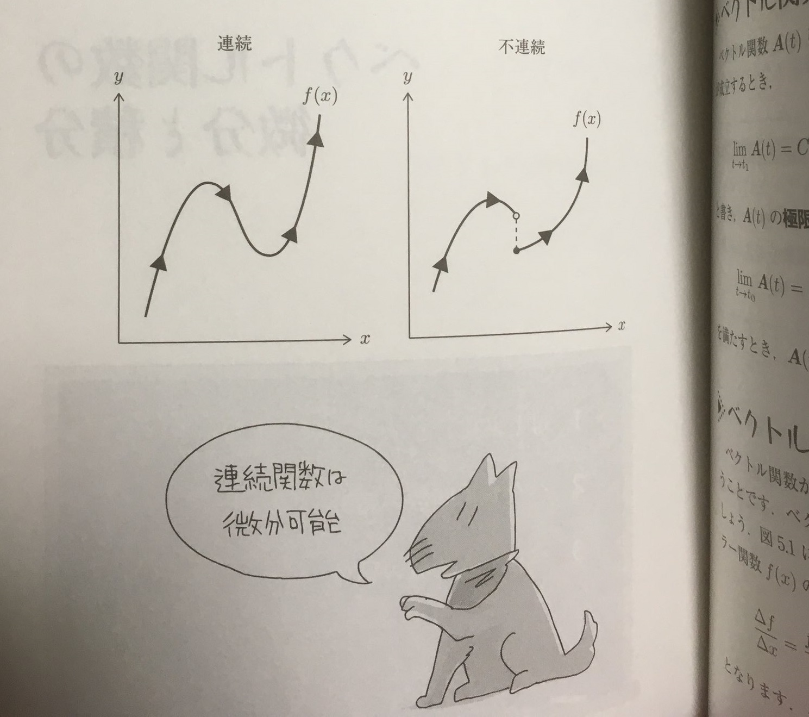
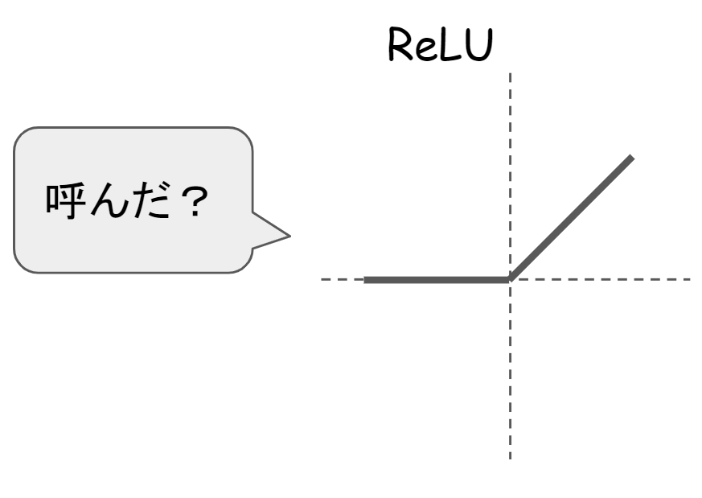
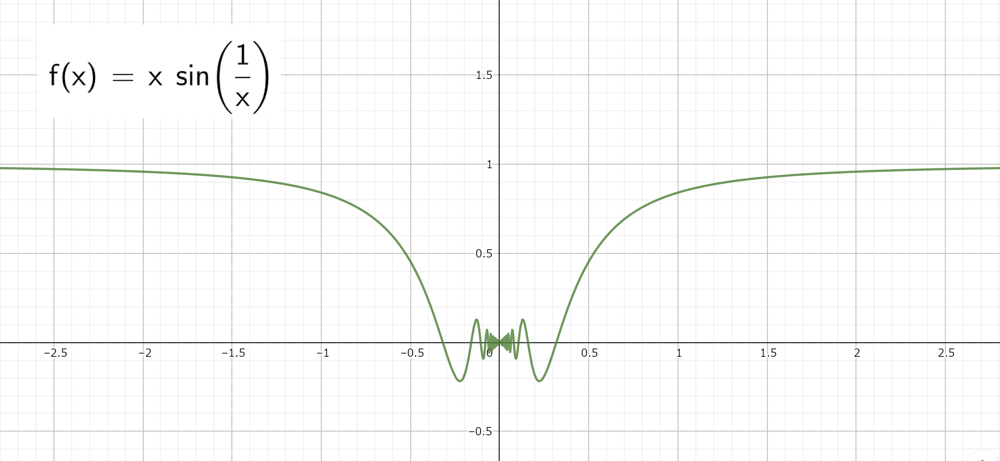
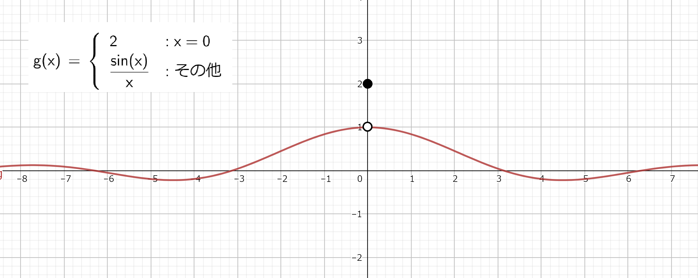

<style>
.reveal h1 {
  font-size: 1.55em;
}
.reveal h2 {
  font-size: 1.3em;
}
.reveal h3 {
  font-size: 1.2em;
}
.reveal h4 {
  font-size: 1.1em;
}
.reveal .slides p {
  text-align: left;
}
.reveal .slides ul {
  display: block;
}
.reveal .slides ol {
  display: block;
}
</style>

# 連鎖律のやや厳密な証明

#### noshiro@

#### 2020/07/28

---

## 「連続函数は微分可能」？？ 🤔

<div>
  
</div>
<div style="font-size: 10px">
  <a href="https://books.google.co.jp/books?id=5OJqDwAAQBAJ&pg=PA40&hl=ja&source=gbs_toc_r&cad=4#v=onepage&q&f=false" alt="ベクトルからはじめる電磁気学" >
  「ベクトルからはじめる電磁気学」（坂本 文人）
  </a>
  より
</div>

:::



---

## 微分可能とは

（定義）
開区間 $I \subset \R$ で定義され，$\R^n$の値をとる函数 $f: I \to \R^n$と $x \in I$に対して，極限

\\[
\lim\_{\substack{h \to 0 \newline h \neq 0}}\frac{f(x + h) - f(x)}{h} = c
\\]

が存在するとき， $f$ は $x$ で**微分可能**であるといい，$c$を $f$の$x$における**微分係数**という．

<font size="6px">

（注：$h\\; (\neq 0)$ は$x + h \in I$となるように動くものとする．）

</font>

:::

このとき，

\\[
c = f'(x) = \diff{f}{x}(x) = (Df)(x) = (f(x))'
\\]

等と記す．

$I$の各点で$f$が微分可能であるとき，$I \to \R^n$の函数 $x \mapsto f'(x)$ が生ずる．
これを$f$の**導函数**という．

---

## 合成函数の微分（連鎖律）

-   $U, W \subset \R$：開区間
-   $ f: U \to \R$，$ g: W \to \R$：函数
-   $ f(U) \subset W $ （合成可能）

$f$が$x \in U$で微分可能で，$g$が$y := f(x)$で微分可能とすれば，合成函数$\varphi := g \circ f$は微分可能で，

\\[
\varphi'(x) = g'(y)f'(x)
\\]

が成り立つ．

---

よくある間違った証明

\\[
\begin{aligned}
&\lim_{\substack{h \to 0 \newline h \neq 0}} \frac{g(f(x + h)) - g(f(x))}{h} \\newline
&= \lim_{\substack{h \to 0 \newline h \neq 0}} \frac{g(f(x + h)) - g(f(x))}{\blue{f(x + h) - f(x)}}
\cdot \frac{\blue{f(x + h) - f(x)}}{h} \newline
&= \lim_{\substack{h \to 0 \newline h \neq 0}} \frac{g(f(x + h)) - g(f(x))}{f(x + h) - f(x)}
\cdot \blue{\lim_{\substack{h \to 0 \newline h \neq 0}}} \frac{f(x + h) - f(x)}{h} \newline
\end{aligned}
\\]

:::

\\[
\begin{aligned}
&= \lim_{\substack{\blue{k} \to 0 \newline \blue{k} \neq 0}} \frac{g(\blue{y + k}) - g(\blue{y})}{\blue{k}}
\cdot \lim_{\substack{h \to 0 \newline h \neq 0}} \frac{f(x + h) - f(x)}{h} \newline
&= g'(y) f'(x) \newline
\end{aligned}
\\]

（$y := f(x)$，$k := f(x + h) - f(x)$ とおいた．）

:::

\\[
\begin{aligned}
... \newline
&\frac{g(f(x + h)) - g(f(x))}{h} \newline
&=\frac{g(f(x + h)) - g(f(x))}{\red{f(x + h) - f(x)}} \cdot \frac{\red{f(x + h) - f(x)}}{h} \newline
...
\end{aligned}
\\]

```
Traceback (most recent call last):
  File "<stdin>", line 2, in <module>
ZeroDivisionError: division by zero
```

<!--
$x$の増分$\Delta x$ に対する函数 $y = f(x)$ の増分を $\Delta y$，
$y$の増分$\Delta y$ に対する函数 $z = g(y)$ の増分を $\Delta z$とする．
このとき，
\\[
\deltadiff{z}{x} = \deltadiff{z}{y} \cdot \frac{\Delta y}{\Delta x}
\\]

$f(x)$ は $x$ について微分可能であるから連続である．したがって，
$\Delta x \to 0$ のとき $\Delta y = f(x + \Delta x) - f(x) \to 0$ である．
よって，

\\[
\lim_{\Delta x \to 0}\deltadiff{z}{y} = \lim_{\Delta y \to 0}\deltadiff{z}{y}
\\]


したがって，

\\[
\begin{aligned}
\diff{z}{x}
&= \lim_{\Delta x \to 0} \deltadiff{z}{x} \newline
&= \lim_{\Delta x \to 0} \deltadiff{z}{y} \cdot \lim_{\Delta x \to 0}\deltadiff{y}{x} \newline
&= \lim_{\Delta y \to 0} \deltadiff{z}{y} \cdot \lim_{\Delta x \to 0}\deltadiff{y}{x} \newline
&= \diff{z}{y}\cdot \diff{y}{x} \newline
\end{aligned}
\\]
-->

---

（厳密な証明）
可微分性より

\\[ \lim_{\substack{h \to 0 \newline h \neq 0}} \frac{f(x + h) - f(x)}{h} = f'(x) \\]
\\[ \lim_{\substack{k \to 0 \newline k \neq 0}} \frac{g(y + k) - g(y)}{k} = g'(y) \\]

:::

次のように $\varepsilon$ と $\delta$ を定義する．

\begin{alignat}{6}
&\varepsilon(h) :=
\begin{cases}
0 && \text{if } h = 0 \newline
\frac{f(x + h) - f(x)}{h} - f'(x) && \text{otherwise}
\end{cases} \newline
&\delta(k) :=
\begin{cases}
0 && \text{if } k = 0 \newline
\frac{g(y + k) - g(y)}{k} - g'(y) && \text{otherwise}
\end{cases}
\end{alignat}

$0$で定義したことにより，
$\dlim_{h \to 0} \varepsilon(h) = \dlim_{k \to 0} \delta(k) = 0$となり
$\varepsilon$，$\delta$は $0$ で連続．

:::

$k = k(h) = f(x + h) - f(x)$ とおけば， $f$ は $x$で連続だから， $h \to 0$のとき $k(h) \to 0$．

\begin{alignat}{4}
& \varphi(x + h) - \varphi(x) \newline
&= g(f(x + h)) - g(f(x)) \newline
&= g(f(x) + k(h)) - g(f(x)) &\quad & {\scriptsize (\because k(h) = f(x + h) - f(x) )} \newline
&= g(y + k(h)) - g(y) &\quad & {\scriptsize (y = f(x))} \newline
&= (g'(y) + \delta(k(h))) \cdot k(h) &\quad & {\scriptsize (\text{by the definition of } \delta)} \newline
&= g'(y)k(h) + \delta(k(h))k(h) \newline
\end{alignat}

:::

\begin{alignat}{4}
&= g'(y)k(h) + \delta(k(h))k(h) \newline
&= g'(y) \cdot h(f'(x) + \varepsilon(h)) + \delta(k(h))k(h) \newline
& \quad {\scriptsize (\because k(h) = f(x + h) - f(x) = h(f'(x) + \varepsilon(h)))} \newline
&= g'(y)f'(x)h + \left\\{ g'(y)\varepsilon(h) + \frac{k(h)}{h} \delta(k(h)) \right\\} h \newline
\end{alignat}

:::

$h \to 0$ のとき $\varepsilon(h) \to 0$， $\delta(k(h)) \to 0$．

\\[
\frac{k(h)}{h} = \frac{f(x + h) - f(x)}{h} = \varepsilon(h) + f'(x)
\\]
より $\frac{k(h)}{h}$ は 0 のある除外近傍で有界である．

以上より，

\\[
g'(y)\varepsilon(h) + \frac{k(h)}{h} \delta(k(h)) \to 0 \\; (h \to 0)
\\]

:::

よって，

\\[
\begin{aligned}
&\lim_{h \to 0} \frac{\varphi(x + h) - \varphi(x)}{h} \newline
&= \lim_{h \to 0} \left\\{ g'(y)f'(x) + \left( g'(y)\varepsilon(h) + \frac{k(h)}{h} \delta(k(h)) \right) \right\\} \newline
&= g'(y)f'(x)
\end{aligned}
\\]

<div style="display: flex; justify-content: flex-end;">

$\square$.

</div>

---

## 除外近傍って？

$a \in \R^n$，$\varepsilon > 0$ に対し
$$U_0(a, \varepsilon) = \\{ x \in \R^n \mid 0 < |x - a| < \varepsilon \\}$$
を $a$ の**除外$\varepsilon$近傍**といい，ある $\varepsilon > 0$に対する $U_0(a, \varepsilon)$を単に $a$ の**除外近傍**という．

---

## 合成函数の極限の注意点

先ほどの証明では，

$\dlim_{h \to 0} k(h) = 0$
かつ
$\dlim_{k \to 0} \delta(k) = 0$
ならば
$\dlim_{h \to 0} \delta(k(h)) = 0$
であることを使っている．

---

ところが，

$\dlim_{\substack{h \to 0 \newline \blue{h \neq 0}}} k(h) = 0$
かつ
$\dlim_{\substack{k \to 0 \newline \blue{k \neq 0}}} \delta(k) = 0$
ならば
$\dlim_{\substack{h \to 0 \newline \blue{h \neq 0}}} \delta(k(h)) = 0$
は <font color="red">一般に成り立たない</font>．

（$k$と$\delta$を$0$で定義され連続であるようにしなければならない）

---

## 合成函数の極限

-   $U, W \subset \R$
-   $ f: U \to \R$，$ g: W \to \R$：函数
-   $ f(U) \subset W $ （合成可能）

$a \subset \ol{U}$に対して，$b = \dlim_{x \to a}{f(x)}$が存在すれば，
$b \in \ol{f(U)} \subset \ol{W}$．
さらに， $\dlim_{y \to b} g(y) = c$ が存在すれば，
$\dlim_{x \to a} (g \circ f)(x) = c$
が成り立つ．

---

## （準備）定理 a

-   $A \subset \R^n$
-   $f : A \to \R^m$：函数
-   $B \subset A$
-   $a \in \ol{B}$

このとき，次の 1. と 2. は同値

1. $\dlim_{\substack{x \to a \newline x \in B}} f(x) = b$
2. $x_n \to a \\; (n \to \infty)$ となる任意の $B$ の点列 `$(x_n)_{n\in \N}$`に対して，
   $f(x_n) \to b \\; (n \to \infty)$ である．

:::

（補足）
$\ol{A}$の定義

$A$を $\R^n$ の部分集合とする．$b \in \R^n$ はその任意の $\varepsilon$ 近傍が $A$ と交わるとき，
$A$の**触点**または**接触点**という（$b$のどんな近くにも$A$の点が存在する）．
$A$の触点全体の集合を $A$ の**閉包**といい，$\ol{A}$ と書く．

（例） 開区間 $(a, b)$ の閉包は閉区間 $[a, b]$．

:::

（定理 a 証明）

$(\because 1. \Rightarrow 2.)$

いま 1.が成り立つとすれば，
\\[
\sforall \varepsilon >0 . \sexists \delta > 0 . \sforall x \in B . \left( |x - a| < \delta \Rightarrow |f(x) - b| < \varepsilon \right)
\\]
が成り立つ．いま $\dlim_{n \to \infty} x_n = a$ となる $B$ の点列 `$(x_n)_{n \in \N}$` を取れば，上の $\delta > 0$ に対して
$n_0 \in \N$ が存在して $n \geq n_0$ となるすべての $n \in \N$ に対し， $|x_n - a| < \delta$となり，
従って $|f(x_n) - b| < \varepsilon$ となる．

:::

これは $\dlim_{n \to \infty} (x_n) = b$を意味する．

<div style="display: flex; justify-content: flex-end;">

$\square$.

</div>

:::

（定理 a 証明）

$(\because 1. \Leftarrow 2.)$

対偶を示す．

1.の否定は
\\[
\sexists \varepsilon > 0 . \sforall \delta > 0 . \sexists x \in B . \left( |x - a| < \delta \land |f(x) - b| \geq \varepsilon \right)
\\]
特に各自然数 $n \geq 1$ に対して， $x_n \in B$ が存在して， $|x_n - a| < \frac{1}{n}$ かつ $|f(x_n) - b| \geq \varepsilon$となる．

:::

各 $n \geq 1$ に対しこのような $x_n$ を選び出す（選択公理による）ことによって生ずる $B$ の点列 `$(x_n)_{n \geq 1}$` は，
$\dlim_{n \to \infty} x_n = a$ であるが， $|f(x_n) - b| \geq \varepsilon$ だから $\dlim_{n \to \infty} (x_n) = b$ ではない．
すなわち 2.の否定が成り立つ

<div style="display: flex; justify-content: flex-end;">

$\square$.

</div>

---

## 合成函数の極限

-   $U, W \subset \R$
-   $ f: U \to \R$，$ g: W \to \R$：函数
-   $ f(U) \subset W $ （合成可能）

$a \subset \ol{U}$に対して，$b = \dlim_{x \to a}{f(x)}$が存在すれば，
$b \in \ol{f(U)} \subset \ol{W}$．
さらに， $\dlim_{y \to b} g(y) = c$ が存在すれば，
$\dlim_{x \to a} (g \circ f)(x) = c$
が成り立つ．

:::

(合成函数の極限 証明）

$a \in \ol{U}$ だから $x_n \to a$ となる $U$ の点列 $(x_n)_{n \in \N}$ が存在し，定理 a により
このとき $f(x_n) \to b$ だから， $b \in \ol{f(U)}$ となる． また， $f(U) \subset E$（合成可能の条件）だから，
$\ol{f(U)} \subset \ol{E}$　である  
（$A \subset B \Rightarrow \ol{A} \subset \ol{B}$の証明は省略）．

:::

（合成函数の極限 証明続き）

$x_n \to a$ となる任意の $U$ の点列 `$(x_n)_{n \in \N}$` に対して，
仮定 $\dlim_{x \to a} f(x) = b$ から， $y_n = f(x_n) \to b \\; (n \to \infty)$ となる（定理 a）．

そこでまた $g(f(x_n)) \to c \\; (n \to \infty)$ となる．

これは定理 a により $\dlim_{x \to a} (g \circ f)(x) = c$ を意味する．

---

## 合成関数の極限（**※嘘定理**）

-   $U, W \subset \R$
-   $ f: U \to \R$，$ g: W \to \R$：函数
-   $ f(U) \subset W $ （合成可能）

$a \subset \ol{U}$に対して，$b = \dlim_{\substack{x \to a \newline \blue{x \neq a}}}{f(x)}$が存在すれば，
$b \in \ol{f(U)} \subset \ol{W}$．
さらに， $\dlim_{\substack{y \to b \newline \blue{y \neq b}}} g(y) = c$ が存在すれば，
$\dlim_{\substack{x \to a \newline \blue{x \neq a}}} (g \circ f)(x) = c$
が成り立つ．

---

嘘定理の反例

$U := \\{ x \in \R \mid x \neq 0 \\}$ とし， $f : U \to \R$ を
$f(x) = x \sin\frac{1}{x}$ とする．また， $W = \R$ とし， $g: \R \to \R$ を次のように定義する．

\\[
g(y) =
\begin{cases}
\frac{\sin y}{y} & \text{if } y \neq 0 \newline
2 & \text{if } y = 0
\end{cases}
\\]

:::



:::



:::

$f(U) \subset \R = W$ だから $f$ と $g$ は合成可能である．そして，$|f(x)| = |x \sin\frac{1}{x}| \leq |x|$ だから
\\[
\lim_{x \to 0} f(x) = \lim_{\substack{x \to 0 \newline x \neq 0}}f(x) = 0
\\]
である．また，
\\[
\lim_{\substack{y \to 0 \newline y \neq 0}}g(y)
= \lim_{\substack{y \to 0 \newline y \neq 0}} \frac{\sin y}{y} = 1
\\]
である．

:::

しかし，このとき $\dlim_{\substack{x \to 0 \newline x \neq 0}}(g \circ f)(x) = 1$ は成り立たない．

実際，各自然数 $n \geq 1$ に対して $x_n = \frac{1}{n \pi}$ と置くと
`$(x_n)_{n \geq 1}$` は $U$ の点列で `$\dlim_{n \to \infty} x_n = 0$` である．

ところが，すべての $n \geq 1$ に対し $\red{f(x_n) = 0}$， $\red{(g \circ f)(x_n) = 2}$ だから，
$\dlim_{n \to \infty} (g \circ f)(x_n) = 2$ である．
よって $\dlim_{\substack{x \to 0 \newline x \neq 0}}(g \circ f)(x) =1$ は成り立たない．

:::

（解説）

定理 a より，$\dlim_{\substack{x \to a \newline x \in B}} f(x) = b$とは
$x_n \to a \\; (n \to \infty)$ となる**どのような** $B$ の点列 `$(x_n)_{n\in \N}$`を選んでも
$\dlim_{n \to \infty} f(x_n) = b$ であることであったから，
そうならない点列を一つ示せば反例になる．

:::

この例では，点列 `$(x_n)_{n \geq 1}$`を$f$で飛ばした先がちょうどすべて $0$ になるように条件を満たす点列をうまく選び，
$g$ を $0$ で不連続だが $\dlim_{\substack{y \to 0 \newline y \neq 0}} g(y) = 1$ を満たす函数と定義することで，

$\dlim_{\substack{x \to 0 \newline x \neq 0}}{f(x)} = 0$
かつ
$\dlim_{\substack{y \to 0 \newline y \neq 0}} g(y) = 1$
だが
$\dlim_{\substack{x \to 0 \newline x \neq 0}} (g \circ f)(x) \neq 1$
となる例を作っている．

:::

（$f$の極限を考える時の定義域の制限 $U' \subset U$ の$f$による像 $f(U')$を
$g$の極限を考える時の定義域の制限 $W' \subset W$ が含む必要がある．）

---

連鎖律の証明では

$$ \dlim_{h \to 0} k(h) = 0 \land \dlim_{k \to 0} \delta(k) = 0 \Rightarrow \dlim_{h \to 0} \delta(k(h)) = 0$$

を使っている（注：$h$や$k$の定義域から$0$を除外していない）が，これは $\delta$ を $0$ で定義して連続になるようにしたため，合成関数の極限の定理が使えるようになっている．

---

参考文献

-   東京大学出版会「解析入門 Ⅰ」 杉浦光夫著
