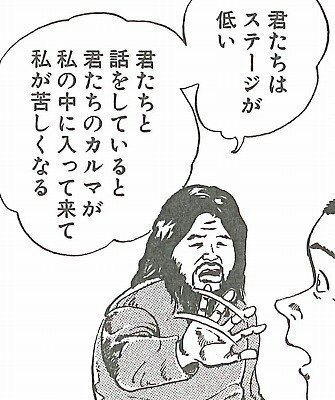
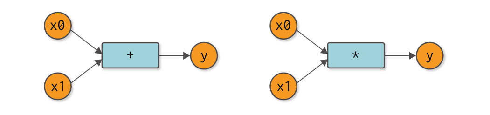
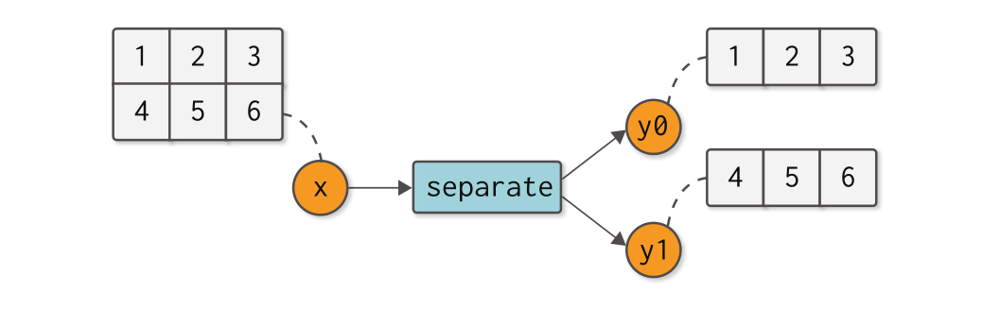
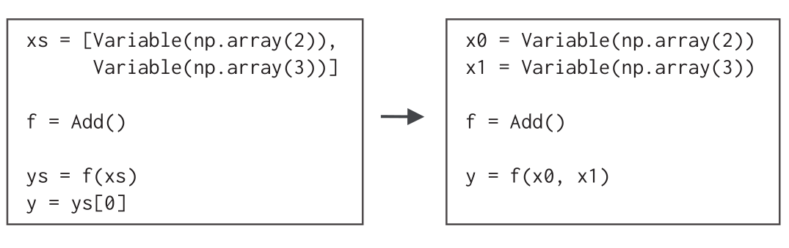
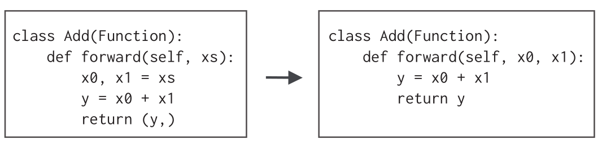
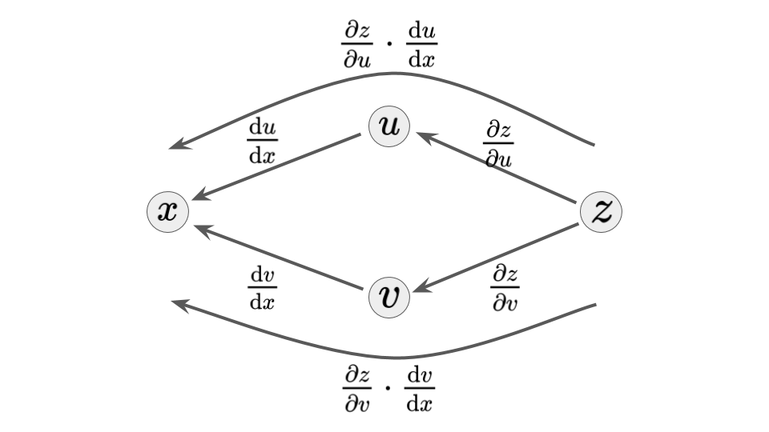
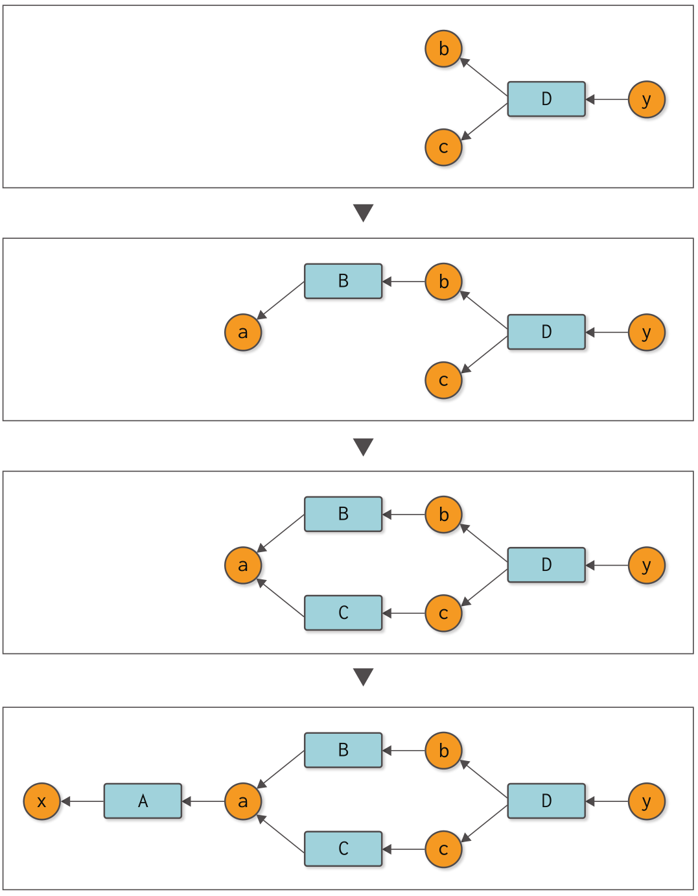
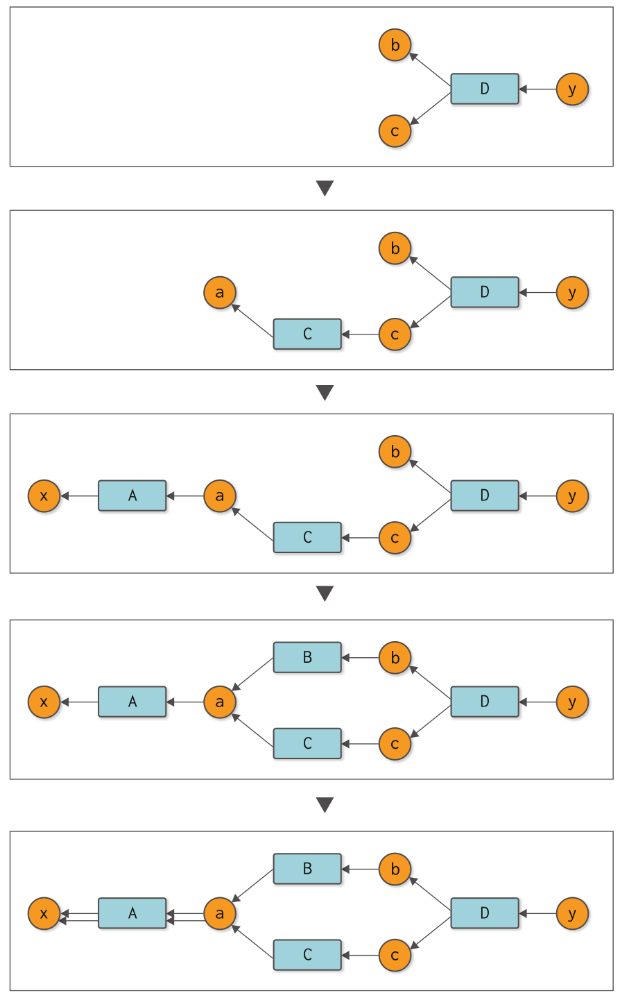
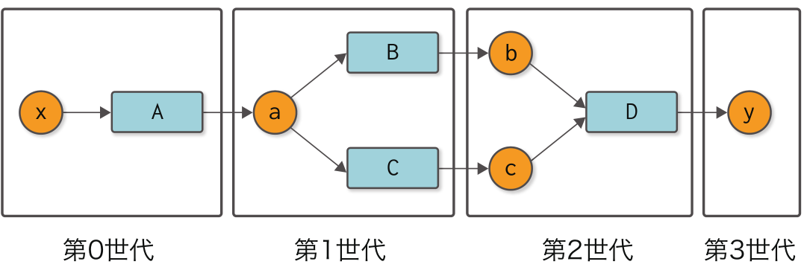
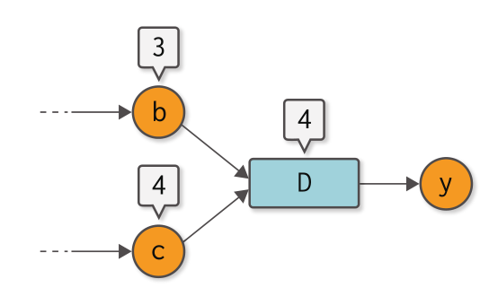

ゼロから作るディープラーニング ❸


第 3 回 (2020/07/14)

noshiro@

---

## Step 06

手作業によるバックプロパゲーション

<font size="5em">
※担当範囲を間違えてた
</font>

---

### Chain rule （連鎖律）

`$$ (h \circ g \circ f)(x) := h(g(f(x)))$$`
`$$ (h \circ g \circ f)'(x) = h'(z) g'(y) f'(x)$$`
where `$y := f(x)$` and `$z := g(y)$`

:::

### 厳密な証明

金曜に発表しようかな～

---

-   `$f(x) := x^2$`, `$g(x) := e^x$`, `$h(x) := x^2$`
-   `$f'(x) = h'(x) = 2x$`, `$g'(x) = e^x$`
-   input: `$0.5$`
-   `$y := f(0.5) = 0.5^2 = 0.25$`
-   `$z := g(y) = e^y = e^{0.25}$`

`$$ \begin{aligned} (h \circ g \circ f)'(x) &= h'(z) g'(y) f'(x) \\ &= 2z \cdot e^y \cdot 2x \\ &= 2\cdot e^{0.25} \cdot e^{0.25} \cdot 2 \cdot 0.5 \\ &= 2 \cdot e^{0.5} \simeq 3.2974 \end{aligned}$$`

---

### step06.py (modified)

```py
import numpy as np


class Variable:
    def __init__(self, data):
        self.data = data
        self.grad = None


class Function:
    def __call__(self, arg):
        self.input = arg
        return Variable(self.forward(arg.data))

    def forward(self, x):
        raise NotImplementedError()

    def backward(self, gy):
        raise NotImplementedError()


class Square(Function):
    def forward(self, x):
        return x ** 2

    def backward(self, gy):
        x = self.input.data
        gx = 2 * x * gy
        return gx


class Exp(Function):
    def forward(self, x):
        return np.exp(x)

    def backward(self, gy):
        x = self.input.data
        gx = np.exp(x) * gy
        return gx


f = Square()
g = Exp()
h = Square()

x = Variable(np.array(0.5))
y = f(x)
z = g(y)
w = h(z)

w.grad = np.array(1.0)
z.grad = h.backward(w.grad)
y.grad = g.backward(z.grad)
x.grad = f.backward(y.grad)
print(x.grad)  # 3.297442541400256

```

:::

疑問

-   いちいち `.grad` に保存している意味は？
-   途中の値
    -   `x.grad = $h'(z) g'(y) f'(x)$`
    -   `y.grad = $h'(z) g'(y)$`
    -   `z.grad = $h'(z)$`
    -   `w.grad = $1$`

直線的計算グラフだと忘れてよさそうなので意図が分かりづらいが、
分岐や合流を含む計算グラフだと値を複数回使う必要があるので、
途中の計算結果を保存しておきたいのが理由（多分）。

---

## step 07

バックプロパゲーションの自動化

---

### step06.py

```py

...

w.grad = np.array(1.0)
z.grad = h.backward(w.grad)
y.grad = g.backward(z.grad)
x.grad = f.backward(y.grad)

...
```

↑ これをやめたい

---

### step07.py (modified)

```py
import numpy as np


class Variable:
    def __init__(self, data):
        self.data = data
        self.grad = None
        self.creator = None

    def set_creator(self, func):
        self.creator = func

    def backward(self):
        f = self.creator  # 1. Get a function
        if f is not None:
            # 2. Get the function's input
            x = f.input
            # 3. Call the function's backward
            x.grad = f.backward(self.grad)
            x.backward()


class Function:
    def __call__(self, arg):
        self.input = arg
        self.output = Variable(self.forward(arg.data))
        self.output.set_creator(self)  # Set parent(function)
        return self.output

    def forward(self, x):
        raise NotImplementedError()

    def backward(self, gy):
        raise NotImplementedError()


class Square(Function):
    def forward(self, x):
        return x ** 2

    def backward(self, gy):
        x = self.input.data
        gx = 2 * x * gy
        return gx


class Exp(Function):
    def forward(self, x):
        return np.exp(x)

    def backward(self, gy):
        x = self.input.data
        gx = np.exp(x) * gy
        return gx


f = Square()
g = Exp()
h = Square()

x = Variable(np.array(0.5))
w = h(g(f(x)))

w.grad = np.array(1.0)
w.backward()
print(x.grad)  # 3.297442541400256

```

↑ この辺から Variable をクラスで実装していた意味が出てくる．

---

### diff step06.py vs step07.py

```diff
 import numpy as np


 class Variable:
     def __init__(self, data):
         self.data = data
         self.grad = None
+        self.creator = None
+
+    def set_creator(self, func):
+        self.creator = func
+
+    def backward(self):
+        f = self.creator
+        if f is not None:
+            x = f.input
+            x.grad = f.backward(self.grad)
+            x.backward()


 class Function:
     def __call__(self, arg):
         self.input = arg
-        return Variable(self.forward(arg.data))
+        self.output = Variable(self.forward(arg.data))
+        self.output.set_creator(self)
+        return self.output

     def forward(self, x):
         raise NotImplementedError()

     def backward(self, gy):
         raise NotImplementedError()


 class Square(Function):
     def forward(self, x):
         return x ** 2

     def backward(self, gy):
         x = self.input.data
         gx = 2 * x * gy
         return gx


 class Exp(Function):
     def forward(self, x):
         return np.exp(x)

     def backward(self, gy):
         x = self.input.data
         gx = np.exp(x) * gy
         return gx


 f = Square()
 g = Exp()
 h = Square()

 x = Variable(np.array(0.5))
-y = f(x)
-z = g(y)
-w = h(z)
+w = h(g(f(x)))

 w.grad = np.array(1.0)
-z.grad = h.backward(w.grad)
-y.grad = g.backward(z.grad)
-x.grad = f.backward(y.grad)
+w.backward()
 print(x.grad)  # 3.297442541400256

```

---

<div>
  
</div>

---

注意

-   枝分かれ・合流を含む計算グラフや、変数が複数回利用されるような複雑な計算グラフにはまだ対応できていない。

---

## Step 08

再帰からループへ

---

### diff step07.py vs step08.py

```diff
import numpy as np


class Variable:
    def __init__(self, data):
        self.data = data
        self.grad = None
        self.creator = None

    def set_creator(self, func):
        self.creator = func

    def backward(self):
-        f = self.creator
-        if f is not None:
-            x = f.input
-            x.grad = f.backward(self.grad)
-            x.backward()
+        funcs = [self.creator]
+        while funcs:
+            f = funcs.pop()
+            x, y = f.input, f.output
+            x.grad = f.backward(y.grad)
+
+            if x.creator is not None:
+                funcs.append(x.creator)


class Function:
    def __call__(self, arg):
        self.input = arg
        self.output = Variable(self.forward(arg.data))
        self.output.set_creator(self)
        return self.output

    def forward(self, x):
        raise NotImplementedError()

    def backward(self, gy):
        raise NotImplementedError()


class Square(Function):
    def forward(self, x):
        return x ** 2

    def backward(self, gy):
        x = self.input.data
        gx = 2 * x * gy
        return gx


class Exp(Function):
    def forward(self, x):
        return np.exp(x)

    def backward(self, gy):
        x = self.input.data
        gx = np.exp(x) * gy
        return gx


f = Square()
g = Exp()
h = Square()

x = Variable(np.array(0.5))
w = h(g(f(x)))

w.grad = np.array(1.0)
w.backward()
print(x.grad)  # 3.297442541400256

```

:::

疑問

-   `funcs` をリストにしてる意味は無いのでは？

:::

```diff
import numpy as np


class Variable:
    def __init__(self, data):
        self.data = data
        self.grad = None
        self.creator = None

    def set_creator(self, func):
        self.creator = func

    def backward(self):
        funcs = [self.creator]
        while funcs:
+           print([f.name for f in funcs])
            f = funcs.pop()  # 1. Get a function
            x, y = f.input, f.output  # 2. Get the function's input/output
            x.grad = f.backward(y.grad)  # 3. Call the function's backward

            if x.creator is not None:
                funcs.append(x.creator)


class Function:
+   def __init__(self, name):
+       self.name = name

    def __call__(self, arg):
        self.input = arg
        self.output = Variable(self.forward(arg.data))
        self.output.set_creator(self)
        return self.output

    def forward(self, x):
        raise NotImplementedError()

    def backward(self, gy):
        raise NotImplementedError()


class Square(Function):
    def forward(self, x):
        return x ** 2

    def backward(self, gy):
        x = self.input.data
        gx = 2 * x * gy
        return gx


class Exp(Function):
    def forward(self, x):
        return np.exp(x)

    def backward(self, gy):
        x = self.input.data
        gx = np.exp(x) * gy
        return gx


+f = Square("f")
+g = Exp("g")
+h = Square("h")

x = Variable(np.array(0.5))
w = h(g(f(x)))

w.grad = np.array(1.0)
w.backward()
print(x.grad)  # 3.297442541400256

```

```
['h']
['g']
['f']
3.297442541400256
```

:::

-   `funcs` をリストにしてる意味は無いのでは？  
    → 直線的な計算グラフだから無意味に思えるだけで、分岐や合流があると親が複数になったりするので意味が出てくる

---

## Step 09

関数をより便利に

---

### 要約

-   コードの見た目の~~改善~~改悪
-   Python はクソ

※~~本気~~冗談です

---

## Step 10

テストを行う

---

### 要約

-   テストは大事

---

## コラム：自動微分

コンピュータのプログラムで微分を求める 3 つの方法

-   数値微分（numerical differentiation）
-   数式微分（symbolic differentiation）
    -   Mathematica や MATLAB
-   自動微分（automatic differentiation）
    -   chain rule を使うもの

---

# 第 2 ステージ

自然なコードで表現する



---

## Step 11

可変長の引数（順伝播編）

---

合流・分岐する計算グラフに対応する




---

### diff step09.py vs step11.py

```diff

 import numpy as np


 class Variable:
     def __init__(self, data):
         if data is not None:
             if not isinstance(data, np.ndarray):
                 raise TypeError('{} is not supported'.format(type(data)))

         self.data = data
         self.grad = None
         self.creator = None

     def set_creator(self, func):
         self.creator = func

     def backward(self):
         if self.grad is None:
             self.grad = np.ones_like(self.data)

         funcs = [self.creator]
         while funcs:
             f = funcs.pop()
             x, y = f.input, f.output
             x.grad = f.backward(y.grad)

             if x.creator is not None:
                 funcs.append(x.creator)


 def as_array(x):
     if np.isscalar(x):
         return np.array(x)
     return x


 class Function:
-    def __call__(self, arg):
-        self.input = arg
-        self.output = Variable(as_array(self.forward(arg.data)))
-        self.output.set_creator(self)
-        return self.output
+    def __call__(self, inputs):
+        xs = [x.data for x in inputs]  # Get data from Variable
+        ys = self.forward(xs)
+        self.inputs = inputs
+        self.outputs = [Variable(as_array(y)) for y in ys]  # Wrap data
+
+        for output in self.outputs:
+            output.set_creator(self)
+        return self.outputs

-    def forward(self, x):
+    def forward(self, xs):
         raise NotImplementedError()

-    def backward(self, gy):
+    def backward(self, gys):
         raise NotImplementedError()

- class Square(Function):
-     def forward(self, x):
-         return x ** 2
-
-     def backward(self, gy):
-         x = self.input.data
-         gx = 2 * x * gy
-         return gx
-
-
- class Exp(Function):
-     def forward(self, x):
-         return np.exp(x)
-
-     def backward(self, gy):
-         x = self.input.data
-         gx = np.exp(x) * gy
-         return gx
-
-
- def square(x):
-     return Square()(x)
-
-
- def exp(x):
-     return Exp()(x)
-
-
- x = Variable(np.array(0.5))
- y = square(exp(square(x)))
- y.backward()
- print(x.grad)
-
-
- x = Variable(np.array(1.0))  # OK
- x = Variable(None)  # OK
- # x = Variable(1.0)  # NG
+ class Add(Function):
+     def forward(self, xs):
+         x0, x1 = xs
+         y = x0 + x1
+         return (y,)
+
+
+ xs = [Variable(np.array(2)), Variable(np.array(3))]
+ f = Add()
+ ys = f(xs)
+ y = ys[0]
+ print(y.data)
```

---

## Step 12

可変長の引数（改善編）

---

### 要約

-   リストを受け取る関数から可変長引数に
-   要素数 1 の配列をただのスカラーにする  
    （本当にそれで良いのか？？）

---



---



---

### diff step11.py vs step12.py

```diff
 import numpy as np


 class Variable:
     def __init__(self, data):
         if data is not None:
             if not isinstance(data, np.ndarray):
                 raise TypeError('{} is not supported'.format(type(data)))

         self.data = data
         self.grad = None
         self.creator = None

     def set_creator(self, func):
         self.creator = func

     def backward(self):
         if self.grad is None:
             self.grad = np.ones_like(self.data)

         funcs = [self.creator]
         while funcs:
             f = funcs.pop()
             x, y = f.input, f.output
             x.grad = f.backward(y.grad)

             if x.creator is not None:
                 funcs.append(x.creator)


 def as_array(x):
     if np.isscalar(x):
         return np.array(x)
     return x


 class Function:
-    def __call__(self, inputs):
+    def __call__(self, *inputs):
         xs = [x.data for x in inputs]
-        ys = self.forward(xs)
+        ys = self.forward(*xs)
+        if not isinstance(ys, tuple):
+            ys = (ys,)
         self.inputs = inputs
         self.outputs = [Variable(as_array(y)) for y in ys]

         for output in self.outputs:
             output.set_creator(self)
-        return self.outputs
+        return self.outputs if len(self.outputs) > 1 else self.outputs[0]

     def forward(self, xs):
         raise NotImplementedError()

     def backward(self, gys):
         raise NotImplementedError()


 class Add(Function):
-    def forward(self, xs):
-        x0, x1 = xs
-        return (x0 + x1,)
+    def forward(self, x0, x1):
+        return x0 + x1


-xs = [Variable(np.array(2)), Variable(np.array(3))]
-ys = Add()(xs)
-y = ys[0]
+x0 = Variable(np.array(2))
+x1 = Variable(np.array(3))
+y = Add()(x0, x1)
 print(y.data)

```

---

## Step 13

可変長の引数（逆伝播編）

---

`$$f(x_0, x_1) := x_0 + x_1$$`
のとき
`$$\partialdiff{f}{x_0} = 1$$`
`$$\partialdiff{f}{x_1} = 1$$`

---

### diff step12.py vs step13.py

```diff
 import numpy as np


 class Variable:
     def __init__(self, data):
         if data is not None:
             if not isinstance(data, np.ndarray):
                 raise TypeError('{} is not supported'.format(type(data)))

         self.data = data
         self.grad = None
         self.creator = None

     def set_creator(self, func):
         self.creator = func

     def backward(self):
         if self.grad is None:
             self.grad = np.ones_like(self.data)

         funcs = [self.creator]
         while funcs:
             f = funcs.pop()
-            x, y = f.input, f.output
-            x.grad = f.backward(y.grad)
+            gys = [output.grad for output in f.outputs]
+            gxs = f.backward(*gys)
+            if not isinstance(gxs, tuple):
+                gxs = (gxs,)

-            if x.creator is not None:
-                funcs.append(x.creator)
+            for x, gx in zip(f.inputs, gxs):
+                x.grad = gx
+
+                if x.creator is not None:
+                    funcs.append(x.creator)


 def as_array(x):
     if np.isscalar(x):
         return np.array(x)
     return x


 class Function:
     def __call__(self, *inputs):
         xs = [x.data for x in inputs]
         ys = self.forward(*xs)
         if not isinstance(ys, tuple):
             ys = (ys,)
         self.inputs = inputs
         self.outputs = [Variable(as_array(y)) for y in ys]

         for output in self.outputs:
             output.set_creator(self)
         return self.outputs if len(self.outputs) > 1 else self.outputs[0]

     def forward(self, xs):
         raise NotImplementedError()

     def backward(self, gys):
         raise NotImplementedError()


 class Square(Function):
     def forward(self, x):
         return x ** 2

     def backward(self, gy):
-        x = self.input.data
+        x = self.inputs[0].data
         gx = 2 * x * gy
         return gx


 class Add(Function):
     def forward(self, x0, x1):
         return x0 + x1

+    def backward(self, gy):
+        return gy, gy


 x = Variable(np.array(2.0))
 y = Variable(np.array(3.0))

 z =  Add()(Square()(x), Square()(y))
+z.backward()
 print(z.data)
+print(x.grad)
+print(y.grad)

```

```
13.0
4.0
6.0
```

---

<font size="6em">

`funcs`をリストで持っていた意味がここに来てようやく分かる

</font>

```diff
import numpy as np


class Variable:
    def __init__(self, data):
        if data is not None:
            if not isinstance(data, np.ndarray):
                raise TypeError('{} is not supported'.format(type(data)))

        self.data = data
        self.grad = None
        self.creator = None

    def set_creator(self, func):
        self.creator = func

    def backward(self):
        if self.grad is None:
            self.grad = np.ones_like(self.data)

        funcs = [self.creator]
        while funcs:
+           print([f.name for f in funcs])
            f = funcs.pop()
            gys = [output.grad for output in f.outputs]
            gxs = f.backward(*gys)
            if not isinstance(gxs, tuple):
                gxs = (gxs,)

            for x, gx in zip(f.inputs, gxs):
                x.grad = gx

                if x.creator is not None:
                    funcs.append(x.creator)


def as_array(x):
    if np.isscalar(x):
        return np.array(x)
    return x


class Function:
+   def __init__(self, name):
+       self.name = name

    def __call__(self, *inputs):
        xs = [x.data for x in inputs]
        ys = self.forward(*xs)
        if not isinstance(ys, tuple):
            ys = (ys,)
        self.inputs = inputs
        self.outputs = [Variable(as_array(y)) for y in ys]

        for output in self.outputs:
            output.set_creator(self)
        return self.outputs if len(self.outputs) > 1 else self.outputs[0]

    def forward(self, xs):
        raise NotImplementedError()

    def backward(self, gys):
        raise NotImplementedError()


class Square(Function):
    def forward(self, x):
        return x ** 2

    def backward(self, gy):
        x = self.inputs[0].data
        gx = 2 * x * gy
        return gx


class Add(Function):
    def forward(self, x0, x1):
        return x0 + x1

    def backward(self, gy):
        return gy, gy


x = Variable(np.array(2.0))
y = Variable(np.array(3.0))

-z =  Add()(Square()(x), Square()(y))
+z =  Add("add")(Square("sq1")(x), Square("sq2")(y))
z.backward()
print(z.data)
print(x.grad)
print(y.grad)

```

```
['add']
['sq1', 'sq2']
['sq1']
13.0
4.0
6.0
```

---

## Step 14

同じ変数を繰り返し使う

---

`y = Add()(x, x)`に対応できるようにする．


---

```py
x = Variable(np.array(3.0))
y = Add()(x, x)
print('y', y.data)
y.backward()
print('x.grad', x.grad)
```

`$y = 2x$`だから `$\partialdiff{y}{x} = 2$`となるはず…

```sh
y 6.0
x.grad 1.0
```

`$\partialdiff{y}{x} = 1$` ？？

---

### fix step14.py

-   `x.grad`を`gx`で上書きしていたところが原因。
-   `x.grad = (x.grad ?? 0) + gx`とする。
-   代わりに`x.grad`がステートフルになってしまったので，リセットメソッド`cleargrad`を用意

:::

```diff
 import numpy as np


 class Variable:
     def __init__(self, data):
         if data is not None:
             if not isinstance(data, np.ndarray):
                 raise TypeError('{} is not supported'.format(type(data)))

         self.data = data
         self.grad = None
         self.creator = None

     def set_creator(self, func):
         self.creator = func

+    def cleargrad(self):
+        self.grad = None
+
     def backward(self):
         if self.grad is None:
             self.grad = np.ones_like(self.data)

         funcs = [self.creator]
         while funcs:
             f = funcs.pop()
             gys = [output.grad for output in f.outputs]
             gxs = f.backward(*gys)
             if not isinstance(gxs, tuple):
                 gxs = (gxs,)

             for x, gx in zip(f.inputs, gxs):
-                x.grad = gx
+                if x.grad is None:
+                    x.grad = gx
+                else:
+                    x.grad = x.grad + gx

                 if x.creator is not None:
                     funcs.append(x.creator)


 def as_array(x):
     if np.isscalar(x):
         return np.array(x)
     return x


 class Function:
     def __call__(self, *inputs):
         xs = [x.data for x in inputs]
         ys = self.forward(*xs)
         if not isinstance(ys, tuple):
             ys = (ys,)
         self.inputs = inputs
         self.outputs = [Variable(as_array(y)) for y in ys]

         for output in self.outputs:
             output.set_creator(self)
         return self.outputs if len(self.outputs) > 1 else self.outputs[0]

     def forward(self, xs):
         raise NotImplementedError()

     def backward(self, gys):
         raise NotImplementedError()


 class Add(Function):
     def forward(self, x0, x1):
         return x0 + x1

     def backward(self, gy):
         return gy, gy


 x = Variable(np.array(3.0))
 y = Add()(x, x)
 y.backward()
 print(x.grad)


 x = Variable(np.array(3.0))  # or x.cleargrad()
 y = Add()(Add()(x, x), x)
 y.backward()
 print(x.grad)

```

:::

なんで足し算した？

```diff
-                x.grad = gx
+                if x.grad is None:
+                    x.grad = gx
+                else:
+                    x.grad = x.grad + gx
```

:::

函数 `$z = z(u, v)$` が**全微分可能**かつ `$u = u(x)$` および `$v = v(x)$` が微分可能であるとき，

`$$ \diff{z}{x} = \partialdiff{z}{u} \diff{u}{x} + \partialdiff{z}{v} \diff{v}{x} $$`



:::

（証明）復習して今度喋ります。

---

## Step 15

複雑な計算グラフ（理論編）

---

顧客が本当に求めていた back propagation

<div style="height: 70vh; overflow-y: auto !important">



</div>

---

実装された運用

<div style="height: 70vh; overflow-y: auto !important">



</div>

---

深さを覚えておいて適切な順番で実行する必要がある



---

## ステップ 16

複雑な計算グラフ（実装編）

---

### 要約

-   計算グラフを構築するときに`depth`をメモする。
-   `depth` 順に関数を実行する（それだけ）
-   （サンプルコードでは簡単のために sort が使われているけど）ちゃんと priority queue で実装しましょう。
    -   計算グラフは一度定義された後変化しないのでもっと効率良い実装方法もありそう
        （多分大変だけど）

---

合流時は max をとる



---

✖ 実装された運用（間違い）

```py
import numpy as np


class Variable:
    def __init__(self, data):
        if data is not None:
            if not isinstance(data, np.ndarray):
                raise TypeError('{} is not supported'.format(type(data)))

        self.data = data
        self.grad = None
        self.creator = None

    def set_creator(self, func):
        self.creator = func

    def cleargrad(self):
        self.grad = None

    def backward(self):
        if self.grad is None:
            self.grad = np.ones_like(self.data)

        funcs = [self.creator]
        while funcs:
            f = funcs.pop()
            gys = [output.grad for output in f.outputs]
            gxs = f.backward(*gys)
            if not isinstance(gxs, tuple):
                gxs = (gxs,)

            for x, gx in zip(f.inputs, gxs):
                if x.grad is None:
                    x.grad = gx
                else:
                    x.grad = x.grad + gx

                if x.creator is not None:
                    funcs.append(x.creator)


def as_array(x):
    if np.isscalar(x):
        return np.array(x)
    return x


class Function:
    def __call__(self, *inputs):
        xs = [x.data for x in inputs]
        ys = self.forward(*xs)
        if not isinstance(ys, tuple):
            ys = (ys,)
        self.inputs = inputs
        self.outputs = [Variable(as_array(y)) for y in ys]

        for output in self.outputs:
            output.set_creator(self)
        return self.outputs if len(self.outputs) > 1 else self.outputs[0]

    def forward(self, xs):
        raise NotImplementedError()

    def backward(self, gys):
        raise NotImplementedError()


class Square(Function):
    def forward(self, x):
        return x ** 2

    def backward(self, gy):
        x = self.inputs[0].data
        gx = 2 * x * gy
        return gx


class Add(Function):
    def forward(self, x0, x1):
        return x0 + x1

    def backward(self, gy):
        return gy, gy


x = Variable(np.array(2.0))
a = Square()(x)
y = Add()(Square()(a), Square()(a))
y.backward()

print(y.data)
print(x.grad)
```

```
32.0
96.0
```

---

○ 顧客が本当に必要だったもの（正解）

```py
import numpy as np


class Variable:
    def __init__(self, data):
        if data is not None:
            if not isinstance(data, np.ndarray):
                raise TypeError('{} is not supported'.format(type(data)))

        self.data = data
        self.grad = None
        self.creator = None
        self.generation = 0

    def set_creator(self, func):
        self.creator = func
        self.generation = func.generation + 1

    def cleargrad(self):
        self.grad = None

    def backward(self):
        if self.grad is None:
            self.grad = np.ones_like(self.data)

        funcs = []
        seen_set = set()

        def add_func(f):
            if f not in seen_set:
                funcs.append(f)
                seen_set.add(f)
                funcs.sort(key=lambda x: x.generation)

        add_func(self.creator)

        while funcs:
            f = funcs.pop()
            gys = [output.grad for output in f.outputs]
            gxs = f.backward(*gys)
            if not isinstance(gxs, tuple):
                gxs = (gxs,)

            for x, gx in zip(f.inputs, gxs):
                if x.grad is None:
                    x.grad = gx
                else:
                    x.grad = x.grad + gx

                if x.creator is not None:
                    add_func(x.creator)


def as_array(x):
    if np.isscalar(x):
        return np.array(x)
    return x


class Function:
    def __call__(self, *inputs):
        xs = [x.data for x in inputs]
        ys = self.forward(*xs)
        if not isinstance(ys, tuple):
            ys = (ys,)
        self.inputs = inputs
        self.outputs = [Variable(as_array(y)) for y in ys]

        self.generation = max(x.generation for x in inputs)
        for output in self.outputs:
            output.set_creator(self)
        return self.outputs if len(self.outputs) > 1 else self.outputs[0]

    def forward(self, xs):
        raise NotImplementedError()

    def backward(self, gys):
        raise NotImplementedError()


class Square(Function):
    def forward(self, x):
        return x ** 2

    def backward(self, gy):
        x = self.inputs[0].data
        gx = 2 * x * gy
        return gx


class Add(Function):
    def forward(self, x0, x1):
        return x0 + x1

    def backward(self, gy):
        return gy, gy


x = Variable(np.array(2.0))
a = Square()(x)
y = Add()(Square()(a), Square()(a))
y.backward()

print(y.data)
print(x.grad)

```

```
32.0
64.0
```

:::

`$$y(x) = (x^2)^2 + (x^2)^2 = 2x^4$$`
`$$y'(2.0) = 8\cdot 2^3 = 64$$`

:::

（補足） 👮👮👮

-   max をとるときにリストを生成しないようにしましょう（教科書のコードの修正）

```diff
-max([x.generation for x in inputs])
+max(x.generation for x in inputs)
```

---

diff

```diff
 import numpy as np


 class Variable:
     def __init__(self, data):
         if data is not None:
             if not isinstance(data, np.ndarray):
                 raise TypeError('{} is not supported'.format(type(data)))

         self.data = data
         self.grad = None
         self.creator = None
+        self.generation = 0

     def set_creator(self, func):
         self.creator = func
+        self.generation = func.generation + 1

     def cleargrad(self):
         self.grad = None

     def backward(self):
         if self.grad is None:
             self.grad = np.ones_like(self.data)

-        funcs = [self.creator]
+        funcs = []
+        seen_set = set()
+
+        def add_func(f):
+            if f not in seen_set:
+                funcs.append(f)
+                seen_set.add(f)
+                funcs.sort(key=lambda x: x.generation)
+
+        add_func(self.creator)
+
         while funcs:
             f = funcs.pop()
             gys = [output.grad for output in f.outputs]
             gxs = f.backward(*gys)
             if not isinstance(gxs, tuple):
                 gxs = (gxs,)

             for x, gx in zip(f.inputs, gxs):
                 if x.grad is None:
                     x.grad = gx
                 else:
                     x.grad = x.grad + gx

                 if x.creator is not None:
-                    funcs.append(x.creator)
+                    add_func(x.creator)


 def as_array(x):
     if np.isscalar(x):
         return np.array(x)
     return x


 class Function:
     def __call__(self, *inputs):
         xs = [x.data for x in inputs]
         ys = self.forward(*xs)
         if not isinstance(ys, tuple):
             ys = (ys,)
         self.inputs = inputs
         self.outputs = [Variable(as_array(y)) for y in ys]

+        self.generation = max([x.generation for x in inputs])
         for output in self.outputs:
             output.set_creator(self)
         return self.outputs if len(self.outputs) > 1 else self.outputs[0]

     def forward(self, xs):
         raise NotImplementedError()

     def backward(self, gys):
         raise NotImplementedError()


 class Square(Function):
     def forward(self, x):
         return x ** 2

     def backward(self, gy):
         x = self.inputs[0].data
         gx = 2 * x * gy
         return gx


 class Add(Function):
     def forward(self, x0, x1):
         return x0 + x1

     def backward(self, gy):
         return gy, gy


 x = Variable(np.array(2.0))
 a = Square()(x)
 y = Add()(Square()(a), Square()(a))
 y.backward()

 print(y.data)
 print(x.grad)
```

---

## おしまい
